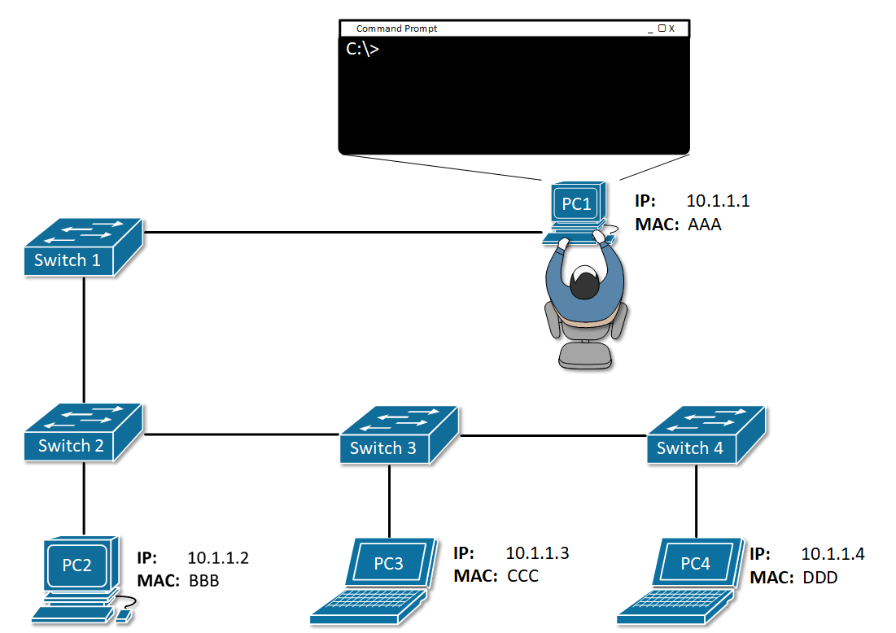
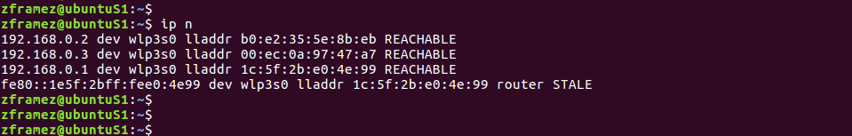

## Docker

[https://raul-profesor.github.io/DEAW/introduction/](https://raul-profesor.github.io/DEAW/introduction/)

[https://kinsta.com/es/base-de-conocimiento/que-es-docker/](https://kinsta.com/es/base-de-conocimiento/que-es-docker/)

[https://datascientest.com/es/docker-todo-que-saber](https://datascientest.com/es/docker-todo-que-saber)

[https://www.ibm.com/topics/docker](https://www.ibm.com/topics/docker)

## ARP

Cuando una máquina necesita comunicarse con otra en una red, necesita conocer en primera instancia su IP para poder enviar el paquete a su destino, pero en capa 2 de OSI, utiliza direcciones MAC. El protocolo ARP entra en juego en este momento, dado que envía los mensajes pertinentes para averiguar la dirección MAC asociada a una IP concreta.


Cuando un dispositivo desea enviar paquetes a otro, lanza un mensaje broadcast ARP preguntando en la red qué disposito posee esa IP concreta y esperando una respuesta únicamente de ese dispositivo identificándose y, además, enviando su MAC.




De esta forma, los dispositivos en la red van construyendo sus tablas ARP, donde cada entrada hace corresponder una IP con su MAC, de tal forma que si tuvieran que volver a enviar mensajes a esas máquinas, ya no necesitan pasar por el proceso de averigüación de direcciones MAC.



## ARP Spoofing

Este ataque es de los conocidos como tipo **Man in the Middle**, llamados así porque consisten en que un atacante o actor malicioso se interpone entre la comnicación de dos víctimas, actuando de intermediario sin que ellas se den cuenta. Esto le permite interceptar toda la comunicación, pudiendo espiarla o incluso modificarla, si así lo desea.

En el caso de un ARP Spoofing, el atacant envía falsos mensajes de respuesta ARP, indicando que su MAC se corresponde con otra IP, la de la víctima y así recibir los mensajes que van destinados a ella.


## Realización de la práctica

Debéis clonar el repositorio: [https://github.com/raul-profesor/spoofing](https://github.com/raul-profesor/spoofing)

Esta práctica está ubicada dentro de la carpeta `Lab1-ArpSpoofing`.

Vamos a crear la siguiente infraestructura:

 

Que consiste en:

+ Dos contenedores *víctimas*
+ Un *atacante*
+ Un *observador* **TcpDumper** cuya única función es escuchar el tráfico de la red

Pasemos a construir las imágenes que más tarde darán lugar a los contenedores del *atacante* y del *TcpDumper* que vamos a ejecutar. Para este cometido no tenéis más que ejecutar el `script build.sh`.
Los contenedores víctimas son simplemente imágenes de [**busybox**](https://unpocodejava.com/2021/11/18/queesbusybox/) sin modificar, directamente del "registry" de Docker.

Ahora ejecutaremos los 4 contenedores, cada uno en una pestaña distinta del terminal:

```bash
docker run -it --rm --name box1 busybox
docker run -it --rm --name box2 busybox
docker run -it --rm --name arpspoofer arpspoofer
docker run -it --rm  --net=container:arpspoofer --name tcpdumper tcpdumper
```

!!!task "Tarea 1"
    + Comprueba las IPs y las MAC de *box1*, *box2* y *arpspoofer* con `ip a`
    + Comprueba la tabla ARP de *box1* con `watch ip neigh`
    + Realiza un ping de *box2* a *box1* y mantenlo
    + En el contenedor del `arpspoofer` comienza el *spoofeo*: `/usr/sbin/arpspoof -r -i eth0 -t x.x.x.x y.y.y.y` (IPs de box1 y 2)

Tras los pasos anteriores deberias empezar a ver el tráfico capturado por el contenedor *TcpDumper*.

!!!task "Tarea 2"
    Además del tcpdump del contenedor *TcpDumper* pon a capturar tráfico con Wireshark en la interfaz `Docker0` de la máquina anfitrión.

!!!task "Tarea 3"
    Describe detalladamente qué observas que está ocurriendo en la captura del contenedor `TcpDumper`

!!!task "Tarea 4"
    ¿Cómo podemos tener una pista de lo que está ocurriendo mirando sólamente el `ping` que hemos lanzado al principio?

!!!task "Tarea 5"
    En la captura de TCPDump, indica y explica <u>detalladamente</u>:
        + Mensajes ARP donde se ve **claramente** qué está ocurriendo y cuál es el ataque, indíca explícitamente los mensajes.
        + Mensajes ICMP donde se ve la secuencia de los acontecimienntos.

!!!task "Tarea 6"
    En la captura de Wireshark filtra por el protocolo ICMP y repite las explicaciones de la Tarea 5.

!!!task "Tarea 7"
        Realiza un diagrama en [https://www.drawio.com/](https://www.drawio.com/) donde expliques claramente de forma gráfica el proceso que has llevado a acabo.
