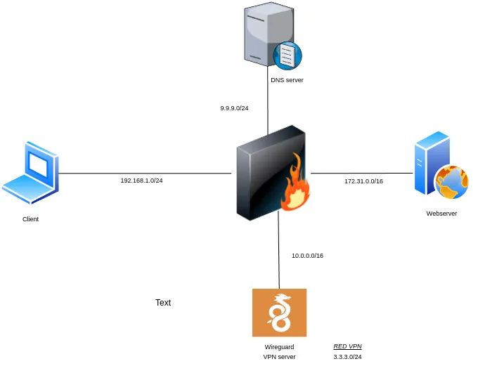

## Primer exercici

En primer lloc, baixem la imatge Docker que utilitzarem per a l'examen:

```console
docker pull br3baj3/examen_practic_1er:latest
```

I una vegada fet això, executem el contenidor amb el nom **examen_container**, en *background* i mapejant el port **8888** de la nostra pròpia màquina al 2222 del contenidor. Després comprovarem que el contenidor està corrent sense problemes:

```console
docker run --name examen_container -d -p 8888:2222 br3baj3/examen_practic_1er:latest

docker ps
```
### [Història de dos ciutats](https://www.filmaffinity.com/es/film229121.html)

Per a esta pràctica/examen, assumirem primer el paper d'un atacant/ciberdelincuent i despŕes el de l'administrador de sistemes que vol solucionar el problema.

### Atacant

Suposem que el atacant ha aconseguit unes credencials d'alguna forma no molt ética i les fa servir.

Haurem d'esperar 1 ó 2 minuts per a que finalitze la provisió del contenidor. Passat este temps podrem conectar-nos per SSH: 

```bash
ssh examen_practic@localhost -p8888
```
!!!info
    + **usuari**: examen_practic
  
    + **contrasenya**: examensad

En primer lloc, l'atacant vol facilitar-se la vida a l'hora de fer servir las credencials i conectar-se a la màquina d'una forma més còmoda.

!!!task "Tasca 1 - Conexió SSH amb claus"
    Crea un parell de claus de 2048 bits amb l'algorisme RSA i copia-les al server per a conectarte mitjançant clau pública. Comprova que funciona correctament.


Després d'una intensa auditoria, el ciberdelincuent ha descobert que la màquina té una vulnerabilitat del paquet <u>pkexec</u> molt crítica anomenada *Pwnkit* que permet a un usuari escalar privilegis i convertir-se en root.

!!!task "Tasca 2 - Explotació de la vulnerabilitat"
    Busca un exploit <u>en python</u> per a **pwnkit** i fes-lo servir a la màquina per a convertir-te en root. Després d'executar-lo introdueix el comandament `id` com a prova.

El ciberdelincuent, aprofitant els seus poders de root, vol cobrir les seues empremtes i per tant, procurarà esborrar dels logs les línies que facin referència al login amb claus (el login original estava amb usuari/contrasenya i una altra cosa alçaría sospites). Per a fer això utilitzarà l'eina **vi** i <u>no</u> **nano**.

!!!tip "Consell"
    Una vegada aconseguida una *shell* de root pots obtenir una shell més amigable amb el comadament  `/bin/bash`

!!!task "Tasca 3 - Ocultació d'evidències"
    Busca entre els arxius del directori a on s'ubiquen tots els logs del sistema totes les línies que facin referència a l'usuari *examen_practic*. Entre eixes línies hi haurà algunes que facin referència al login *ssh* amb clau pública, que també pots filtrar si vols.

    Ara, amb l'eina *vi* obri l'arxiu d'on hagis d'esborrar les línies i esborra només les que mostren un login amb clau pública.

!!!tip "Consells"
    **Vi** és una eina un poc especial, alguns consells per a fer-lo servir:

      + Per pasar al mode d'inserció de text heu de prémer primer la tecla **i**
        + En este mode podeu escriure i esborar
      + Després d'escriure lo desitjat, heu d'eixir del mode d'inserció prement la tecla *ESC*
      + Fora del mode d'inserció de text podeu buscar paraules escrivint **/terme_a_buscar** (important la barra)
        + Per a buscar la següent coincidència, premeu **n**
      + Per a esborrar una línea sencera d'una vegada, fora del mode d'inserció de text, vos coloqueu en la línia y premeu **dd**
      + Per a guardar i eixir, eixiu del mode d'inserció de text (tecla **ESC**) i escriviu **:wq** (important els dos punts)

Després d'esborrar les pistes que el delaten, l'atacant decidix que utilitzar aquest usuari es perillós pel risc que té de que el pugen descobrir. Es per això que ha decidit fer servir un altre usuari. Consultant l'arxiu `/etc/passwd`ha vist que el mes indicat és un anomenat **altre_usuari**.

!!!task "Tasca 4 - Desxifrat de contrasenya"
    1. Treu la línia que et fa falta de l'arxiu `/etc/shadow`    
    2. Instal·la johntheripper dins del contenidor i fes-lo servir per a desxifrar la contrasenya
        + Com a usuari root pots fer `apt install john`
    3. Comprova que, efectivament, pots conectar-te per SSH amb el nou usuari

### Administrador de sistemes

Després d'una àrdua tasca d'investigació, el administrador de sistemes ha descobert quina es la vulnerabilitat que ha fet servir l'atacant i ha de procedir a solucionar-la.

L'administrador té un usuari propi:

!!!info
    + **usuari**: ubuntu
  
    + **contrasenya**: iessevero


!!!task "Tasca 5 - Mitigació"
    1. Busca informació de com **<u>mitigar</u>** la vulnerabilitat i posa-lo en pràctica.
    2. Busca informació sobre com **solucionar-lo** i indica el comandament que sería necessari introduïr per a fer-lo.
    3. Comprova que l'exploit ja no funciona


!!!warning "Atenció!"
    La tasca es considera correcta amb la mitigació i la indicació de com solucionar-lo. En cas de que vulgues fer-lo més real, pots fet l'actualització necessària però **pot trigar molt de temps**. Tens dos opcions, o deixar indicat el comandament o executar-lo i deixar-lo funcionar mentres continues amb l'examen.


Per a augmentar un poc la seguretat, l'administrador decideix aplicar una nova **<u>política de contrasenyes</u>**. Concretament aplicarà els següents paràmetres:

+ Al ficar el nou password, si no compleix la política, només deixarà 3 intents abans de tornar un error
+ La longitud mínima del password ha de ser 12 caràcters
+ Només deixa que la contrasenya continga el mateix carácter consecutiu 3 vegades
+ El password ha de contindre al menys 2 lletres mayúscules
+ Al menys una lletra minúscula és necessària
+ Ha de contindre com a mínim 2 dígits
+ La política ha d'aplicar-se també a l'usuari root

En quant a **<u>la vida útil de la contrasenya</u>**:

+ La contrasenya caducarà als 6 mesos
+ No fa falta esperar cap temps o día per a canviar la contrasenya
+ Avisarà l'usuari de que la contrasenya caduca als 5 mesos

Per a comprovar la política, des-de l'usuari **ubuntu** per a canviar la contrasenya de l'usuari **examen_practic** pels següents valors:

1. aBC24
2. AAAAbecedari24
3. Contrasenya.forta.2024
4. CONTRASENYA.FORTA.2024
5. HoAproveSegur1
6. examenSAD2024

!!!Task "Tasca 6 - Política de contrasenyes"
    + Configura la política demanada
    + Mostra com cada 3 intents infructuosos, et dona un error.
    + Mostra en els logs on es puguen vore els intents i l'éxit final, utilitzant el comandament: `sudo journalctl | grep passwd`


## Segon exercici

Donat el següent escenari:



1. El client pot fer `curl` al webserver
2. El client pot fer consultes DNS al servidor DNS amb `nslookup domini dnsserver` o per ip `nslookup domini $IP_DNS_SERVER`
3. El client pot fer ping a tots els servidors
4. Podràs conectar-te a la VPN

Si conectes a la VPN, podrás vore que:

1. No pots fer consultes DNS al servidor DNS
2. No pots fer `curl` al webserver

Desconecta't de la VPN.

Ara, dins del contenidor del firewall, aplica l'arxiu de regles que trobaràs en `/usr/local/bin`.

1. Ara podràs fer ping als servidors
2. Però no podràs fer consultes DNS al servidor DNS però sí `curl` al webserver
3. No podràs conectar-te a la VPN

!!!task "Tasca"
    Afegix les regles necessàries a l'arxiu de regles de **nftables** per tal de que:
    
      + Pugues conectar-te a la VPN
      + ***Una vegada conectat a la VPN***, pugues fer curl al webserver
      + ***Una vegada conectat a la VPN***, pugues fer consultes DNS al servidor DNS
      + Col·loca contadors en totes les regles

!!!warning "Atenció!"
    + Recorda que és possible que hagis de fer canvis en la configuració de la VPN també
      + Pots regenerar la configuració amb `docker compose up -d wireguard`
      + Recorda copiar-la al `client1`
    + Fes les comprovacions oportunes i mostra totes les regles amb contadors > 0

!!!tip "Tip"
    + Per facilitat, fixa't si pots canviar els arxius que necessites des d'el teu ordinador fent servir els volums de Docker.