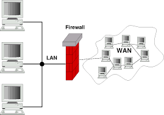

## Firewalls

### **¿Qué es un Firewall?**

Un **firewall** (cortafuegos en español) es un dispositivo o software que se utiliza para controlar y monitorear el tráfico de red que entra y sale de un sistema o red, de acuerdo con un conjunto de reglas predefinidas. Los firewalls son una de las principales herramientas de seguridad utilizadas en redes y sistemas informáticos para protegerlos de accesos no autorizados, ataques maliciosos y otros riesgos de seguridad.



El objetivo principal de un firewall es separar las redes internas (seguras) de las externas (potencialmente inseguras), como Internet. Esto se logra filtrando el tráfico de red que atraviesa el sistema, de manera que solo se permita el tráfico autorizado, y se bloquee el tráfico no deseado.

### **Tipos de Firewalls**

Existen varios tipos de firewalls, cada uno con un enfoque diferente para proteger las redes.


1. **Firewalls de Filtrado de Paquetes (Packet Filtering Firewalls)**

Los firewalls de filtrado de paquetes son la forma más básica. Funcionan a nivel de la capa de red (Capa 3 del modelo OSI), y se centran en inspeccionar los encabezados de los paquetes de red. Deciden si un paquete debe ser permitido o bloqueado basándose en reglas predefinidas como:

- Dirección IP de origen o destino.

- Puerto de origen o destino.

- Protocolo (TCP, UDP, ICMP).

- Estado de la conexión (en algunos casos).

**Ventajas**:

- Rápidos y eficientes en términos de rendimiento.

- Simples de implementar.

**Desventajas**:

- No son capaces de inspeccionar el contenido del paquete ni de mantener el estado de las conexiones.

2. **Firewalls de Inspección de Estado (Stateful Firewalls)**

A diferencia de los firewalls de filtrado de paquetes, los firewalls de inspección de estado mantienen el estado de las conexiones. Esto significa que no solo inspeccionan los paquetes de red, sino que también conocen el contexto de las conexiones que están permitiendo o bloqueando. Por ejemplo, un firewall stateful puede verificar si un paquete de respuesta corresponde a una solicitud previamente enviada desde dentro de la red.

**Ventajas**:

- Son más seguros que los firewalls de filtrado de paquetes porque pueden rastrear el estado de las conexiones.

- Pueden tomar decisiones más inteligentes basadas en el estado de la conexión.

**Desventajas**:

- Mayor consumo de recursos, ya que necesita mantener información sobre el estado de cada conexión.

- Puede ser más complejo de configurar.

3. **Firewalls de Inspección Profunda de Paquetes (Deep Packet Inspection - DPI)**

Estos firewalls son mucho más avanzados y se encargan de inspeccionar tanto los encabezados como el contenido de los paquetes. Permiten detectar ciertos tipos de tráfico o patrones específicos, como aplicaciones maliciosas, malware, o intentos de intrusión. Son capaces de filtrar el tráfico a un nivel más detallado, lo que proporciona un control más preciso sobre qué tráfico es permitido y qué tráfico es bloqueado.

**Ventajas**:

- Proporcionan una capa de seguridad adicional, permitiendo la detección de amenazas complejas.

- Pueden bloquear tráfico de aplicaciones no deseadas o maliciosas (como malware, virus, etc.).

**Desventajas**:

- Requieren más recursos de procesamiento y pueden afectar el rendimiento.

- Son más complejos de configurar y gestionar.

4. **Firewalls de Aplicación (Application Firewalls)**

Los firewalls de aplicación se centran en proteger aplicaciones específicas, como servidores web o bases de datos, de ataques que explotan vulnerabilidades a nivel de la aplicación (por ejemplo, ataques como SQL injection, XSS, etc.). Estos firewalls operan en la capa 7 del modelo OSI (capa de aplicación).

**Ventajas**:

- Protegen aplicaciones específicas de amenazas que otros firewalls no pueden detectar.

- Pueden ofrecer una mayor granularidad en el control del tráfico.

**Desventajas**:

- Necesitan ser configurados específicamente para cada aplicación.

- Pueden ser más difíciles de implementar y mantener.

---
## Nftables vs Iptables

**Nftables** és el reemplaçament modern de **iptables** a Linux, introduït per abordar diverses limitacions d'iptables alhora que ofereix una funcionalitat i un rendiment millorats.

### **Estat actual:**
- Tot i que **iptables** no està completament obsolet, **nftables** ha estat el marc de filtratge de paquets predeterminat a la majoria de distribucions principals de Linux des del 2018 (per exemple, Debian 10+, Ubuntu 20.04+ i CentOS 8+).
- La capa de compatibilitat (`iptables-nft`) permet als usuaris gestionar les regles d'iptables existents al backend de nftables, suavitzant la transició.

Tot i que iptables encara és funcional i s'utilitza àmpliament, cada cop s'està eliminant gradualment a favor de nftables. Ací teniu una visió general de per què nftables es considera el successor:

---

### **1. Per què iptables està en desús:**
- **Complexitat i manteniment:**
 iptables utilitza eines separades per gestionar diferents tipus de paquets (per exemple, `iptables`, `ip6tables`, `ebtables`). Això crea redundància i complica la gestió de regles.

- **Problemes de rendiment:**
 iptables té un mecanisme de concordança de regles lineal, és a dir, cada paquet ha de travessar totes les regles de manera seqüencial, cosa que pot provocar ineficiències en grans conjunts de regles.

- **Manca de flexibilitat:**
 Les regles d'iptables són estàtiques i la implementació de casos d'ús més complexos (per exemple, actualitzacions dinàmiques de regles o filtratge avançat) és complicat.

- **Sense marc unificat:**
 Com que té múltiples eines per a IPv4, IPv6 i Ethernet, no té una interfície unificada, cosa que la fa menys eficient per gestionar entorns de xarxa moderns i heterogenis.

---

### **2. Avantatges de nftables:**
- **Marc unificat:**
 nftables utilitza una única utilitat (`nft`) per gestionar el filtratge d'IPv4, IPv6 i Ethernet, racionalitzant la gestió.

- **Rendiment millorat:**
 nftables utilitza una representació interna de regles més eficient, amb estructures de dades com taules hash i intervals per a una concordança més ràpida.

- ** Sintaxi més senzilla:**
 La sintaxi de la regla nftables és més compacta i més fàcil d'entendre que iptables.

- **Actualitzacions de regles dinàmiques:**
 Les regles es poden actualitzar dinàmicament sense esborrar ni interrompre els conjunts de regles existents.

- **Compatibilitat enrere:**
 Les regles d'iptables es poden traduir a nftables mitjançant la capa de compatibilitat `iptables-nft`.

- **Extensibilitat:**
 nftables està dissenyat per donar suport a funcions futures, com ara la classificació de paquets ampliada i accions avançades, fent-lo més a prova de futur.


### **Recomanació:**
Si esteu començant un projecte nou o revisant una configuració de tallafocs existent, considereu canviar a nftables per les seves funcions modernes i per al futur. Eines com **firewalld** a Linux també es construeixen ara sobre nftables, emfatitzant encara més la seva adopció.

---

### **Conceptos Clave en el Funcionamiento de un Firewall**

1. **Reglas (Rules)**:

Las reglas de un firewall definen las condiciones bajo las cuales el tráfico es permitido o denegado. Las reglas son evaluadas en orden, y el tráfico se compara contra ellas para decidir si es permitido o no. Las reglas típicamente contienen:

- Dirección de origen y destino (dirección IP).

- Puertos de origen y destino.

- El protocolo utilizado (TCP, UDP, ICMP, etc.).

- La acción (permitir o bloquear).

2. **Cadenas (Chains)**:

Las cadenas son las secuencias de reglas que un firewall aplica al tráfico entrante y saliente. Una cadena define cómo se debe manejar el tráfico según su dirección (entrada, salida o tránsito) o su tipo. Por ejemplo:

- `INPUT`: Controla el tráfico que entra al sistema.

- `OUTPUT`: Controla el tráfico que sale del sistema.

- `FORWARD`: Controla el tráfico que pasa a través del sistema, pero no está destinado al propio sistema.

3. **Tablas (Tables)**:

Las tablas son contenedores que agrupan las cadenas. En Linux, las tablas más comunes son:

- **filter**: Para el filtrado de tráfico (reglas de firewall).

- **nat**: Para la manipulación de direcciones de red (como NAT y port forwarding).

- **mangle**: Para modificar los paquetes de red.

- **raw**: Para configuraciones de bajo nivel, como habilitar o deshabilitar la conexión de seguimiento de estado.

4. **Políticas Predeterminadas (Default Policies)**:

Si un paquete no coincide con ninguna regla en una cadena, se aplica la política predeterminada de la cadena. Las políticas predeterminadas pueden ser de dos tipos:

- `ACCEPT`: Permitir el tráfico.

- `DROP`: Bloquear el tráfico sin notificar.

---

## **Implementación Práctica con nftables**

**nftables** es la herramienta moderna para gestionar firewalls en Linux. A partir del kernel 3.13, **nftables** reemplazó a **iptables**, **ip6tables**, **arptables** y **ebtables**. Su objetivo es unificar y simplificar la configuración de firewalls en sistemas Linux.

### **Pasos Básicos para Usar nftables**

1. **Comprobar si nftables está disponible**:

Antes de empezar, asegúrate de que nftables esté instalado y habilitado. Para ver si está en uso, puedes usar el siguiente comando:

```bash

sudo nft list ruleset

```

Este comando te mostrará las reglas actuales que se están aplicando en el sistema.

2. **Crear una tabla de filtrado**:

Las tablas contienen las cadenas y reglas. Para crear una tabla de filtrado, usamos el siguiente comando:

```bash

sudo nft add table ip filter

```

Esto crea una tabla llamada `filter` para IPv4. Si estás trabajando con IPv6, se usaría `ip6`.

3. **Crear una cadena**:

Ahora, vamos a crear una cadena dentro de la tabla `filter` para controlar el tráfico de entrada:

```bash

sudo nft add chain ip filter input { type filter hook input priority 0 \; }

```

En este caso, estamos creando la cadena `input`, que se engancha al "hook" de entrada. La opción `priority 0` especifica la prioridad de la cadena.

4. **Añadir reglas de filtrado**:

Ahora podemos agregar reglas para controlar el tráfico que entra al sistema. Por ejemplo:

- Permitir tráfico desde una IP específica:

```bash
sudo nft add rule ip filter input ip saddr 192.168.1.1 accept

```

- Bloquear tráfico desde una IP específica:

```bash
sudo nft add rule ip filter input ip saddr 10.0.0.1 drop
```

- Permitir tráfico HTTP y SSH:

```bash
sudo nft add rule ip filter input tcp dport {22, 80} accept
```

- Rechazar todo el tráfico entrante por defecto:

```bash
sudo nft add rule ip filter input drop
```

5. **Ver las reglas configuradas**:

Para revisar las reglas que has configurado, puedes utilizar el siguiente comando:

```bash
sudo nft list ruleset
```

Este comando te mostrará todas las tablas, cadenas y reglas configuradas en el sistema.

6. **Guardar las reglas**:

Para asegurarte de que las reglas se apliquen después de un reinicio, debes guardarlas en un archivo:

```bash
sudo nft list ruleset > /etc/nftables.conf
```

Luego, para restaurarlas al reiniciar el sistema, puedes usar:

```bash
sudo nft -f /etc/nftables.conf
```

### **Ejemplo Completo de Configuración de un Firewall Básico con nftables**

Imagina que quieres crear un firewall básico con las siguientes reglas:

- Permitir todo el tráfico desde la red interna (192.168.1.0/24).

- Bloquear todo el tráfico desde la IP 10.0.0.1.

- Permitir tráfico HTTP (puerto 80) y SSH (puerto 22).

- Denegar todo el tráfico por defecto.

Los comandos serían:

```bash
# Esborrar regles anteriors

sudo nft flush ruleset

# Crear la tabla de filtrado

sudo nft add table ip filter

# Crear la cadena de entrada

sudo nft add chain ip filter input { type filter hook input priority 0 \; policy drop \; }

# Crear cadena per a permetre el pas de tràfic a través del firewall

sudo nft add chain ip filter forward { type filter hook forward priority 0 \; policy drop \; }

# Crear la cadena de entrada d'eixida
 
sudo nft add chain inet my_table output { type filter hook output priority 0 \; policy accept \; }


# Permitir tráfico desde la red interna

sudo nft add rule ip filter input ip saddr 192.168.1.0/24 accept

# Bloquear tráfico desde la IP 10.0.0.1

sudo nft add rule ip filter input ip saddr 10.0.0.1 drop

# Permitir tráfico HTTP y SSH

sudo nft add rule ip filter input tcp dport {22, 80} accept

# Ver las reglas configuradas

sudo nft list ruleset

# Guardar las reglas

sudo nft list ruleset > /etc/nftables.conf
```

Con estos pasos, habrás configurado un firewall básico usando **nftables** que protege tu sistema de accesos no deseados.

---
