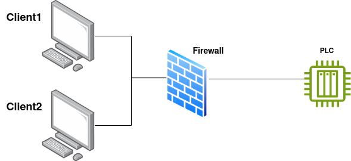

## Introducció

!!!Warning Atenció!
    Heu de fer servir el laboratori de Labtrainer `iptables-ics`

Este laboratori simula l'ús de Iptables per a limitar l'accés a la xarxa d'un component [PLC](https://es.wikipedia.org/wiki/Controlador_l%C3%B3gico_programable) en un entorn indistrial o de [tecnología operativa](https://es.wikipedia.org/wiki/Operational_technology).

L'escenari concret s'il·lustra en la següent imatge:



Quan la configuració és correcta:

+ El client 1 només pot accedir al PLC via SSH i HTTP (port 8080)
+ El client 2 només pot accedir al PLC mitjançant [MODBUS TCP](https://es.wikipedia.org/wiki/Modbus) i HTTP (ports 80 i 8080)

## Realització del laboratori

Inicieu el laboratori com ja sabeu

```console
labtainer iptables-ics
```

I espereu a que vos retorne els terminals corresponents.

+ Wireshark està instal·lat en el contenidor que fa de firewall, utilitzeu-lo per a vore el tràfic que atravesa el firewall i per a depurar les vostres regles (**interfaz `etho`**)
    
    ```console
    wireshark &
    ```
+ Tant en el client 1 com en el 2 per a explorar el serveis oferits pel PLC, podeu fer servir:
    ```console
    ./mtcp-simple.py
    ```
    El que iniciarà un client MODBUS senzill. Observa amb <u>Wireshark</u> el tràfic que es genera, notant quin port TCP com a destí utilitza el client quan es conecta amb el PLC.

+ Inicia Firefox en cada client:
    ```console
    firefox &
    ```
  I accedeix a:

    ```
    http://plc:8080

    http://plc:80
    ```

+ Per últim, accedeix per ssh des dels clients al PLC (no fa falta establir la conexió, només comprobar que n'hi ha accés):

    ```console
    ssh plc
    ```

!!!task "Tasca"
    Fent ús de Iptables instal·lat en el contenidor que fa de firewall, escriu unes regles per a que:

      1. El client 1 només puga accedir al PLC per SSH i HTTP (port 8080 únicament)
      2. El client 2 només tinga accés mitjançant MODBUS TCP i HTTP (ports 80 i 8080)
      3. No se permeteix cap altre tàfic dels clients al PLC
      4. Inclou una regla que puga logar totes les accions

!!!tip Recomanacions
    Podeu agafar com a referencia elñ script d'exemple que teniu al firewall `example_fw.sh`
    
    Fixeu-vos que en este script les IP poden ser diferents de les que vosaltres necessiteu. 

    L'última línea del script loguea els missagte a: `/var/log/iptables.log`. Si incloeu esta directiva en la vostra configuració, podeu observar quan iptables fa drop dels paquets pertinents.

!!!task "Tasca"
    Fent ús del comando `tail -f /var/log/iptables.log`, mostra que es fa drop de paquets que no han d'estar permesos per Iptables.

    Mostra-lo igualment a Wireshark.

    
    