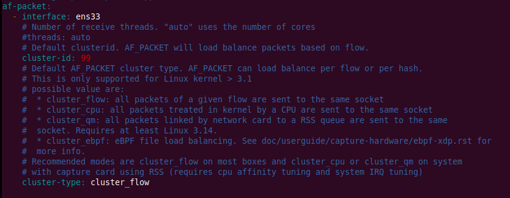

---
title: Monitorización mediante sistemas detectores de intrusos (IDS) y sistemas de prevención de intrusos (IPS)

description:  Apuntes y prácticas Seguridad y Alta disponibilidad (SAD - ASIR). Dentro de la parte de seguridad defensiva del curso de especialista en ciberseguridad vamos a tratar esta vez los Intrusion Detection System (IDS), así como los Intrusion Prevention System (IDP), enumerando sus ventajas y desventajas. En concreto vamos a trabajar con Suricata y justificaremos el motivo por el que lo preferiremos frente a Snort. 

## Introducción

En esta sección vamos a hacer una revisión de los IDS, los IPS y, de refilón, de los SIEM.  Se trata de tres herramientas que, aunque parecidas, contribuyen de forma diferente a la protección de nuestras redes y sistemas. Estamos hablando de unas herramientas de monitorización puesto que examinan el tráfico que entra y/o sale de nuestra red en búsqueda de comportamientos sospechosos.


## IDS

Son sistemas que monitorizan el tráfico entrante y lo cotejan con una base de datos actualizada de firmas de ataque conocidas. Ante cualquier actividad sospechosa, emiten una alerta a los administradores del sistema quienes han de tomar las medidas oportunas. Estos accesos pueden ser ataques esporádicos realizados por usuarios malintencionados o repetidos cada cierto tiempo, lanzados con herramientas automáticas. Estos sistemas sólo detectan los accesos sospechosos emitiendo alertas anticipatorias de posibles intrusiones, pero no tratan de mitigar la intrusión. Su actuación es reactiva.

### ¿Cómo funcionan los IDS?

Podemos distinguir dos tipos de IDS:

1. **NIDS (Network-based intrusion detections systems)**: Monitorizan el tráfico de dos formas; o bien configurándolo para que todo el tráfico de la red pase a través de él o haciendo un port mirroring.
2. **HIDS (Host-based intrusion detections systems)**: Se configura un sistema para comprobar actividad sospechosa o anómala en un host concreto en lugar de en toda la red. Esto limita en gran medida los dipositivos que se monitorizan pero permite detectar con mayor detalle amenazas en ese host.

Típicamente se utilizan tres metodologías para detectar incidentes:

* <u>Basada en firmas:</u> compara las firmas con los eventos observados para identificar posibles incidentes. Se trata del método de detección más sencillo, ya que compara únicamente la unidad de actividad actual (como por ejemplo un paquete o una entrada de log) contra una lista de firmas mediante operaciones de comparación de cadenas. 
    Estas firmas permiten al IDS distinguir entre el uso normal del PC y el uso fraudulento, y/o entre el tráfico normal de la red y el tráfico que puede ser resultado de un ataque o intento del mismo y sonpatrones de ataque preconfigurados y predeterminados.

    {: style="t:275px;width:600px"}

* <u>Detección basada en anomalías:</u> compara las definiciones de lo que se considera una actividad normal con los eventos observados para identificar desviaciones significativas. Este método de detección puede ser muy eficaz para detectar amenazas desconocidas hasta ahora.
  
    {: style="height:275px;width:425px"}

* <u>Análisis de protocolos de estado:</u> utiliza información sobre las conexiones entre hosts y la compara con las entradas de una tabla de estado. La tabla de estado mantiene un registro de la conexión entre las computadoras que incluye: dirección IP de origen y puerto, dirección IP de destino y puerto, y los protocolos que se utilizan. 
    Este método busca cambios repentinos o bruscos en la actividad de la red. Otras funciones incluyen a veces el seguimiento del estado del protocolo, los análisis dinámicos del protocolo de aplicación y el reensamblaje de paquetes IP, lo que evita que fragmentos de paquetes IP lleguen a la red interna.

    Entre las **ventajas** del análisis de protocolo de estado están:

      - Identifica secuencias inesperadas de comandos.
      - Añade características de estado al análisis regular de protocolos.
      - Comprueba la racionalidad de los umbrales de los comandos individuales.
  
    Entre las **desventajas** están:

      - Uso intensivo de recursos, sobrecarga de recursos elevada.
      - No puede detectar ataques que no violen las características de comportamiento del protocolo generalmente aceptado.
      - Presenta conflictos entre el modelo de protocolo utilizado por el sistema y cómo se implementa realmente el protocolo.


## IPS

IPS (Intrusion Prevention System) o sistema de prevención de intrusiones: es un software que se utiliza para proteger a los sistemas de ataques e intrusiones. Como su nombre indica, su actuación es de carácter preventivo. 

Estos sistemas llevan a cabo un análisis en tiempo real de las conexiones y los protocolos para determinar si se está produciendo o se va a producir un incidente, identificando ataques según patrones, anomalías o comportamientos sospechosos y permitiendo el control de acceso a la red, implementando políticas que se basan en el contenido del tráfico monitorizado, es decir, el IPS además de lanzar alarmas, puede descartar paquetes y desconectar conexiones.

{: style="height:275px;width:600px"}

Muchos proveedores ofrecen productos mixtos, llamándolos IPS/IDS, integrándose frecuentemente con cortafuegos y UTM (en inglés Unified Threat Management o Gestión Unificada de Amenazas) que controlan el acceso en función de reglas sobre protocolos y sobre el destino u origen del tráfico.

{: style="height:500px;width:550px"}

## Limitaciones de de los IDS/IPS

No todo es bonito con estos sistemas, algunos de sus handicaps más importantes son:

+ Un IDS sólo detectará lo que esté configurado para detectar. Es decir, están limitados únicamente a detectar ataques ya conocidos. 
+ Son completamente dependientes de las reglas que escribamos o les carguemos y esto lleva inevitablemente a los **falsos positivos**. Una regla configurada para detectar un ataque también puede generar una alerta ante tráfico legítimo si ésta no ha sido configurada con sumo cuidado o si el ataque usa un patrón común de tráfico.
+ Capacidades limitadas ante tráfico cifrado.
+ Su visibilidad está limitada en función de dónde se coloquen en la red.


## SIEM

SIEM (Security Information and Event Management) o sistema de gestión de eventos e información de seguridad: es una solución híbrida centralizada que engloba la gestión de información de seguridad (Security Information Management) y la gestión de eventos (Security Event Manager). 

La tecnología SIEM proporciona un análisis en tiempo real de las alertas de seguridad generadas por los distintos dispositivos hardware y software de la red. Recoge los registros de actividad (logs) de los distintos sistemas, los relaciona y detecta eventos de seguridad, es decir, actividades sospechosas o inesperadas que pueden suponer el inicio de un incidente, descartando los resultados anómalos, también conocidos como falsos positivos y generando respuestas acordes en base a los informes y evaluaciones que registra, es decir, es una herramienta en la que se centraliza la información y se integra con otras herramientas de detección de amenazas.

{: style="height:400px;width:650px"}

# Suricata

Suricata es un sistema de detección de código abierto que puede actuar tanto como IDS como IPS. Su desarrollo corresponde a Open Information Security Foundation (OSIF). Utiliza un set de reglas y firmas que permite detectar y prevenir amenazas. Puede correr en Windows, Mac, Unix y Linux.


## Suricata vs Snort

Snort es el otro gran actor conocido en el juego de los IDS. También de código abierto, aunque posee dos sets de reglas principales: las community edition y las de suscriptor. Estas últimas son de pago y están desarrolladas, probadas y aprobadas por el grupo de seguridad de Cisco, Talos. 


En esencia, Suricata permite acciones por defecto (principalmente relacionadas con la funcionalidad de IPS), que Snort no. No obstante, con una serie de modificaciones es posible hacer que la funcionalidad de Snort pueda ser casi igual, sino igual, a la de Suricata. Aún con todo esto y siempre sin tener en cuenta preferencias personales, podemos destacar algunas **ventajas** de Suricata:

+ Trabaja con multithreading. Esto representa una gran ventaja puesto que a día de hoy es normal analizar grandes cantidades de tráfico que requieren un gran procesado, por lo que sin duda este punto marca una gran diferencia.
+ Es multitenancy. Esto quiere decir que podemos tener diferentes conjuntos de reglas aplicándose al mismo tiempo y asignar cada una de ellas a una VLAN diferente, por ejemplo.
+ Se podría decir que el logging de Suricata es *de mejor calidad* y que permite extraer mayor información del tráfico que lo atraviesa.
+ Permite utilizar directamente, sin modificación alguna, las reglas de Snort.

Como todo, siempre hay **desventajas o inconvenientes**, quizás incluso aplicable a cualquier IDS/IPS:

+ La configuración es ardua y difícil. Tunearlo hasta que sea realmente útil puede llegar a ser un auténtico calvario que haga replantearse la utilidad vs esfuerzo.
+ Una de las causas del punto anterior sería la gran cantidad de falsos positivos debido a reglas, en ocasiones, demasiado genéricas. Las reglas de pago de Snort por ejemplo mejoran esto en gran medida.
+ Las empresas que se lo pueden permitir económicamente suelen desestimar Suricata en favor de soluciones comerciales como los NGFW (Next Generation Firewalls) o plataformas como las de Fortinet o IBM.
+ Hoy en día gran cantidad del tráfico va cifrado y el SSL Stripping puede convertirse en un [gran problema](https://www.calyptix.com/top-threats/nsa-warns-of-https-inspection-risks/), ya sea por condiciones de confidencialidad, como por la gran cantidad de recursos que supone de hardware, de adminstración de endpoints o errores de certificados en los firewalls.

## Demo y ejercicios

!!!info
    Para este ejercicio he utilizado una máquina virtual Debian 11 Bullseye con la interfaz en modo puente, instalando Suricata desde los repositorios. Si bien Suricata puede instalarse en cualquier distribución, es posible que necesitéis algunos pasos adicionales o algo diferentes si utilizáis otra.

!!!warning "Atención"
    Todos los comandos de esta demo han sido ejecutados con el usuario root o, en su defecto, usando `sudo`.

En este ejercicio deberéis llevar a cabo las siguientes acciones:

1. Instalar Suricata
    Hay varias opciones para instalar:

     + [Desde el repositorio de paquetes de la distribución Linux en concreto](https://www.digitalocean.com/community/tutorials/how-to-install-suricata-on-debian-11)
     + [Desde un repositorio personal (PPA)](https://redmine.openinfosecfoundation.org/projects/suricata/wiki/Ubuntu_Installation_-_Personal_Package_Archives_%28PPA%29)
     + [Compilando el código fuente](https://suricata.readthedocs.io/en/suricata-6.0.0/install.html)
  
    Yo os recomiendo la primera opción, que siempre es la más sencilla.

2. Configurarlo como IDS
    + El archivo de configuración a modificar está en `/etc/suricata/suricata.yaml`
    + Comprobad el nombre de la interfaz de vuestra máquina:
        
        
    
    + Tras ello, en el archivo de configuración anterior, colocadlo donde corresponde en la sección `af.packet` del mismo:   
        
        
    
    +  Para permitir que Suricata permita una recarga *en vivo* de las reglas, es decir, que se puedan añadir, eliminar y editar las reglas sin la necesidad de reiniciar el proceso de Suricata:    
    
        

        Y con este comando le diremos a Suricata que recargue todas las reglas sin reiniciar el proceso:

        ```console
        kill -usr2 $(pidof suricata)
        ```
  
    + Actualizamos las reglas de Suricata:
        
        ```console
        suricata-update -o /etc/suricata/rules
        ```

    + Y para validar la configuración (tardará un poco):
        

    + Se inicia el servicio y se comprueba que está activo (tardará un par de minutos en cargar y parsear las reglas):
        ```console
        systemctl start suricata.service

        systemctl start suricata.service
        ```
        
  

3. Comprobar que muestra las alertas que detecta de acuerdo a sus reglas

    + Probaremos la siguiente regla ([explicación del formato de las reglas/firmas](https://www.digitalocean.com/community/tutorials/understanding-suricata-signatures)):

        

        Que generará una alarma cuando un posible intruso use el comando `id` y éste responda con root. 
        
        Para comprobarlo, accederemos a un site que simule este comportamiento ejecutando lo el siguiente comando:

        ```console
        curl http://testmynids.org/uid/index.html
        ```

    + Y examinamos los logs en busca de la alerta, utilizando su identificador:

        

        Suricata también loguea eventos en `/var/log/suricata/eve.log` usando un formato JSON. La documentación de Suricata recomienda usar la utilidad `jq` para leer y filtrar las entradas de este archivo. Así pues, lo instalamos:

        ```console
        apt install jq
        ```

        Y buscamos la alerta correspondiente:

        ```console
        jq 'select(.alert .signature_id==2100498)' /var/log/suricata/eve.json
        ```

    !!!task "Tarea"
        Documenta adecuadamente todo este proceso con las capturas de pantalla y las explicaciones pertinentes que demuestren la realización y comprobación del mismo.

4. Configurar Suricata como IPS y comprobar su funcionamiento
   
    En este caso vamos a ver como trabajar en capa 3 con el modo *inline* de Suricata usando `iptables`. Para ello, necesitamos instalar una dependencia:

    ```console
    apt-get -y install libnetfilter-queue-dev
    ```

    Ahora haremos que Suricata corra en modo NFQ, o lo que es lo mismo, le decimos que acepte los paquetes que le reenvíe `iptables` sin que el firewall siga aplicando sus reglas al paquete (es posible que tarde varios minutos):

    ```console
    suricata -c /etc/suricata/suricata.yaml -q 0
    ```
    De la misma forma, debemos decirle al firewall que reenvíe todos los paquete que entran y salen de nuestra máquina a Suricata:

    ```console
    sudo iptables -I INPUT -j NFQUEUE
    sudo iptables -I OUTPUT -j NFQUEUE
    ```

    Podemos ver las reglas activas del firewall con:

    ```console
    iptables -vnL
    ```

    Por defecto Suricata corre en modo IDS así que para activar el IPS haremos:

    ```console
    systemctl edit suricata.service
    ```
    Y añadimos las líneas resaltadas:

    ```linuxconfig hl_lines="4-7"
    ### Editing /etc/systemd/system/suricata.service.d/override.conf
    ### Anything between here and the comment below will become the new contents of the file

    [Service]
    ExecStart= 
    ExecStart=/usr/bin/suricata -c /etc/suricata/suricata.yaml --pidfile /run/suricata.pid -q 0 -vvv
    Type=simple

    ### Lines below this comment will be discarded
    . . .
    ```

    Donde `ExecStart=` borra el comando por defecto que systemd utiliza para iniciar un servicio. La siguiente línea define el nuevo comando a utilizar y `Type=simple` se asegura de que systemd pueda manejar el proceso de Suricata como cualquier otro servicio cuando está corriendo en modo IPS.

    Guardamos y reiniciamos systemd para que detecte la nueva configuración del servicio de Suricata:

    ```console
    systemctl daemon-reload
    ```

    Reiniciamos Suricata y comprobamos su estado:

    ```console
    sudo systemctl restart suricata.service
    sudo systemctl status suricata.service
    ```
    !!!task "Tarea"
        Modifica la regla que hemos comprobado anteriormente para que en lugar de generar una alerta (alert), descarte (drop) los paquetes que hagan match con esa regla.
    
5. Escribir una regla para el IPS y comprobar que funciona
    
    Para este cometido vamos otra vez al archivo de configuración `suricata.yaml` y le vamos a indicar que tenga en cuenta un nuevo fichero de reglas/firmas que crearemos más tarde con nuestra regla concreta:

    

    !!!task "Tarea"
        A partir de la documentación proporcionada o de otra que podáis encontrar por Internet, escribid una regla de Suricata para que cuando se produzca una conexión desde cualquier IP origen a cualquier IP destino y puerto 8000, el tráfico sea bloqueado por `iptables`. 
        Ponedle SID 9000001 por ejemplo, para que no haya conflicto con otra regla ya existente.
        Para comprobarla, en la máquina donde está Suricata:

        ```console
        nc -nvlp 8000
        ```

        Y en la máquina anfitriona:

        ```console
        nc IP_Maq_Virtual 8000
        ```
         
    
    !!!tip "Nota"
        Recordad el comando para recargar las reglas (puede tardar un rato):
        ```console
        kill -USR2 $(pidof suricata)
        ```
        Si no os funciona, de acuerdo con la [documentación](https://suricata.readthedocs.io/en/suricata-6.0.0/rule-management/rule-reload.html), probad:

        ```console
        suricatasc -c ruleset-reload-nonblocking
        ```

## Per a Rocky Linux

### IDS

Molts m'heu fet saber que no vos ha funcionat la pràctica amb Ubuntu tampoc. En aquest cas, aprofitarem la màquina virtual de Rocky Linux, on jo mateix he comprovat que funciona correctament.

En primer lloc, per a la instal·lació i posterior configuració de Rocky Linux com a IDS, podem seguir el següent tutorial <u>i no les instruccions anteriors, que eren només per a Debian</u>:

[How To Install Suricata on Rocky Linux 8](https://www.digitalocean.com/community/tutorials/how-to-install-suricata-on-rocky-linux-8)

On s'explica perfectament com instalar i configurar Suricata, així com la manera de fer la mateixa comprovació de la regla de Suricata.

Si teniu qualsevol problema, comproveu que:

+ El firewall està desactivat, sinò desactiveu-lo: `systemctl status firewalld`
+ Que a l'arxiu de configuració `/etc/suricata/suricata.yml` heu canviat en tots els llocs on apareix el nom de la interfaz, per el nom de la vostra
+ Que a l'arxiu `/etc/sysconfig/suricata` no apareix cap nom d'interfaz que no siga el vostre

Una vegada feta esta part, pasarem a la següent, configurar Suricata com a IPS.

### IPS

En aquest cas, ja sabeu que a més d'inspeccionar el tràfic, haurem de tallar-lo en cas de trobar activitat sospitosa. 

!!!question
    ¿Qui pot tallar el tràfic de la xarxa? 

    Efectivament, el firewall. Suricata haurà de treballar amb el firewall per a fer d'IPS.

Podeu seguir qualsevol tutorial, sempre sent conscients de què esteu fent per favor. Jo vos recomane este: [How To Configure Suricata as an Intrusion Prevention System (IPS) on Rocky Linux 8](https://www.digitalocean.com/community/tutorials/how-to-configure-suricata-as-an-intrusion-prevention-system-ips-on-rocky-linux-8)

Si llegiu amb atenció el tutorial, és en el pas 3 concretament a ón comença a configurar-se Suricata per a intercontectar-se amb el firewall, així doncs, podeu obviar el passos anteriors.

Després, seguint amb el passos del tutorial, podeu comprobar amb la regla de l'apartat anterior, si canviant el `alert` per un `drop` es talla el tràfic (haurà de donar timeout i haura de vore-se en els logs).

Una vegada comprovat que l'IPS funciona, haureu d'escriure ara sí, una regla pròpia a l'arxiu `local.rules`, tal i com s'explicava en el punt 5 de la práctica de Debian:


## Referencias

[¿Qué son y para qué sirven los SIEM, IDS e IPS?](https://www.incibe.es/protege-tu-empresa/blog/son-y-sirven-los-siem-ids-e-ips)

[Suricata vs snort](https://www.reddit.com/r/linuxadmin/comments/8nv8kc/suricata_vs_snort/) 

[How to install Suricata in Debian 11](https://www.digitalocean.com/community/tutorials/how-to-install-suricata-on-debian-11)

[How To Install Suricata on Debian 11/Debian 10](https://computingforgeeks.com/how-to-install-suricata-ids-ips-on-debian/)

[Suricta User Guide](https://suricata.readthedocs.io/en/suricata-6.0.0/)