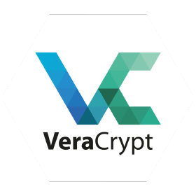

## Confidencialitat mitjantçant xifrat d'arxius amb Veracrypt

### Què és Veracrypt?

VeraCrypt és un software de xifratge de codi obert que s'utilitza per protegir dades sensibles mitjançant la creació de volums xifrats (discs virtuals) o xifrant particions o unitats senceres. 

Proporciona una forta protecció per a les dades mitjançant algorismes de xifratge estàndard del sector i es pot utilitzar en diversos sistemes operatius, inclosos Linux, Windows i macOS.



### Característiques clau de VeraCrypt:
1. **Volums xifrats (discs virtuals)**: VeraCrypt permet crear un **disc virtual xifrat** dins d'un fitxer. Aleshores, aquest fitxer es pot muntar com si fos un disc real, la qual cosa permet emmagatzemar fitxers de manera segura. Quan el volum no està muntat, les dades són inaccessibles i apareixen com a dades aleatòries.

2. **Partició/xifratge de la unitat**: Podeu xifrar una partició sencera o una unitat externa (com ara unitats USB) de manera que tot el que s'emmagatzema a la partició es xifra automàticament.

3. **Xifrat de la unitat del sistema**: VeraCrypt ofereix la possibilitat de **xifrar tota la unitat del sistema** (inclòs el sistema operatiu), proporcionant un xifratge de disc complet (FDE). Això garanteix que no es pugui accedir a cap informació del disc sense la clau de desxifrat, fins i tot si algú accedeix físicament al disc.

4. **Volums ocults i sistemes operatius**: VeraCrypt admet la creació de **volums ocults** i **sistemes operatius ocults**. Aquesta característica s'utilitza per a una negació plausible, permetent als usuaris tenir un sistema operatiu o un volum "señí" mentre mantenen amagat el real.

5. **Algorismes de xifratge forts**: VeraCrypt utilitza diversos algorismes de xifratge potents com ara **AES (Advanced Encryption Standard)**, **Snake** i **Twofish**, sols o combinats (en cascada).

6. **Multiplataforma**: VeraCrypt està disponible per a Linux, Windows i macOS, el que significa que els contenidors xifrats creats en una plataforma es poden obrir en una altra sempre que s'instal·li el programari adequat.

7. **Protecció basada en contrasenyes i fitxers de claus**: VeraCrypt admet tant el xifratge basat en contrasenyes com l'ús de **fitxers de claus** per a més seguretat. Un fitxer de claus és un fitxer (com una imatge o un document aleatori) que s'ha de presentar juntament amb la contrasenya per desbloquejar el volum xifrat.

8. **Autenticació d'arrencada**: Si tota la unitat del sistema està xifrada, VeraCrypt proporciona un mecanisme d'**autenticació prèvia a l'arrencada**, que requereix que introduïu la contrasenya de desxifrat abans que el sistema operatiu es pugui carregar.

### Com funciona VeraCrypt:
1. **Procés de xifratge**: quan creeu un volum xifrat, VeraCrypt utilitza l'algoritme de xifratge seleccionat per xifrar totes les dades que s'emmagatzemaran al volum. El procés es fa de manera transparent, el que significa que podeu interactuar amb els fitxers normalment un cop muntat el volum, però les dades del disc estan xifrades.

2. **Montatge/Desmuntatge**:
 - Munteu un volum xifrat proporcionant la contrasenya i/o el fitxer de claus correctes, moment en què actua com una unitat de disc normal on podeu copiar, moure i accedir a fitxers.
 - Quan hàgiu acabat, podeu **desmuntar** el volum i les dades seran inaccessibles tret que es tornin a muntar amb les credencials correctes.

3. **Algoritmes de xifratge**: VeraCrypt utilitza una combinació dels algorismes de xifratge següents, amb l'opció de posar-los en cascada per a més seguretat:
      - **AES** (estàndard de xifratge avançat)
      - **Serp**
      - **Twofish**
      - **Camèlia** (disponible en versions més noves)

### Casos d'ús:
- **Seguretat de dades**: s'utilitza àmpliament per protegir dades sensibles, com ara documents personals, registres financers i altra informació que ha de romandre privada.

- **Encriptació portàtil**: en xifrar unitats USB o emmagatzematge extern, els usuaris poden portar dades segures i portàtils.

- **Encriptació de disc per a la privadesa**: xifrar el sistema o les unitats de dades garanteix que la informació sensible romangui protegida en cas de robatori o accés no autoritzat.

### VeraCrypt contra TrueCrypt:
VeraCrypt és un **successor de TrueCrypt**, una eina de xifratge popular que es va suspendre el 2014. VeraCrypt aborda diverses vulnerabilitats de seguretat que hi havia a TrueCrypt i té funcions millorades per a un millor xifratge i rendiment.

### Resum:
VeraCrypt és una potent eina per xifrar dades sensibles, que ofereix una varietat de mètodes de xifratge, des de volums simples basats en fitxers fins a xifratge complet del sistema, proporcionant un alt nivell de seguretat i privadesa per als usuaris en múltiples plataformes.

!!!tip "Atenció"
    Per tal de treballar amb més facilitat, vos recomane conectar-vos per SSH a la màquina virtual de tal forma que, entre altres coses, podreu pegar text en el vostre terminal sense problema:

      ```console
      ssh vostre_usuari@ip_rocky
      ```

### Utilitzant Veracrypt per a la privadesa cross platform (Linux - Windows)

#### <u>Pas 1</u>: Instal·lació de VeraCrypt

En primer lloc, haureu d'instalar Veracrypt però per a ser utilitzat en mode línia de comandos, en lloc de amb interficie gràfica (GUI):

```bash
$ sudo yum install fuse wget tar bzip2

$ wget https://launchpad.net/veracrypt/trunk/1.26.14/+download/veracrypt-1.26.14-setup.tar.bz2

$ sudo dnf install gcc make wxBase wxGTK3-devel fuse-devel

$ tar -xvjf veracrypt-1.26.14-setup.tar.bz2

$ sudo ./veracrypt-1.26.14-setup-console-x64 (opció 1)

$ veracrypt --version
```

#### <u>Pas 2</u>: Crear volum de VeraCrypt (contenidor xifrat)

1. Crear un contenidor buit de Veracrypt:

      `$ veracrypt --text --create /ruta/carpeta/arxiu_xifrat`

2. A les opcions interactives que vos anirà demanant heu d'utilitzar les següents dades:
      + Volume type: normal
      + Tamany: 100M
      + Xifrat: AES
      + Hash: SHA-512
      + Filesystem: FAT
      + Password
      + PIM (2n factor autenticació)
      + Keyfile path: buit


#### <u>Pas 3</u>: Muntar el volum de VeraCrypt

1. Heu de crear la carpeta: `/mnt/veracrypt1`
   
2. Després es necessari muntar el arxiu xifrat que heu creat previament  com a una unitat del sistema
```bash 
$ sudo mkdir /mnt/veracrypt1 
$ sudo veracrypt --text /ruta/al/arxiu /mnt/veracrypt1 
``` 
3. Creeu 3 fitxers de text amb qualsevol contingut de text i després copieu-los a la unitat que heu muntat en el pas anterior.

4. Desmunteu la unitat
```bash 
$ sudo veracrypt --dismount /mnt/veracrypt1 
``` 
1. Ara els continguts de la carpeta estan xifrats i emmagatzemast dins en l'arxiu `arxiu_xifrat`

#### <u>Pas 4</u>: Transferir el arxiu xifrat a Windows
Aquest pas ho podeu realitzar mitjançant una unitat usb (pendrive), utilitzant el comand `scp`, muntant un server web amb python3 en Rocky Linux i accedint des del navegador web de Windows...

Per exemple,

En Rocky Linux, en el directory a on tenim el contenidor buit creat abans:

```python
$ python3 -m http.server
```
I des de Windows, amb el navegador web haureu d'accedir a `http://IP_Rocky:8000` i descarregar l'arxiu.

Comprovar que l'arxiu està xifrat al símbol del sistema de Windows:

```cmd
> type arxiu
```

#### <u>Pas 5</u>: Instal·lar VeraCrypt en Windows

Podeu obtenir-lo [ací](https://www.veracrypt.fr/en/Downloads.html).

#### <u>Pas 6</u>: Muntar el volum xifrat en Windows
Munteu el volum que heu xifrat  previament en Linux i comproveu que, efectivament, podeu accedir als arxius xifrats previament:

+ Seleccioneu una unitat lliure
+ Seleccioneu l'arxiu a muntar (el contenidor buit d'abans)
+ Doneu-li a muntar (no oblideu marcar que fa falta PIM)
+ Espereu una estona i hauría d'apareixer-vos com a una nova unitat del sistema
+ Comproveu que podeu accedir a la informació dins dels 3 arxius de text


## Referències


