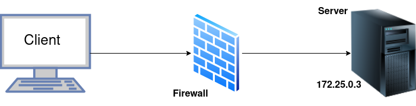

## Introducció

Per a simplificar la infraestructra necessària per a esta pràctica, farem servir un framework anomenat Labtainer. Este framework es capaç de crear diferents laboratoris o escenaris basats en contenidors de Docker. 

En concret, el nostre escenari serà tal que així:




## Labtainer    

Descarregueu la imatge `.ova` del link que teniu a Aules i importeu-la en Virtualbox.

Per tal d'iniciar el laboratori, no tanqueu el terminal s'obrirà automàticament i introudiu:

```sh
labtainer iptables2
```

I començaran a desplegar-se els contenidors i se vos obriràn dues pestanyes en el terminal del firewall. 

!!!tip "Nota"
    Quan vos pregunte per l'email, deixeu-lo en blanc i dieu-li que esteu segurs de deixar-lo en blanc `(y)`

Per a accedir al terminal de qualsevol contenidor podeu fer servir:

```sh
docker exec -it <nom_del_contenidor> /bin/bash
```

## Tasques

Des del client prova a fer un escaneig de ports al server i comenta el resultats:

```sh
nmap server
```

Prova a accedir per SSH:

```sh
ssh server
```

I confirma que s'oferix el servici de Telnet:

```sh
telnet server
```

Al contenidor *firewall* està instal·lat Iptables. Fes-lo servir per a permetre únicament la redirecció (forwarding) de tràfic SSH i HTTP. Per tal d'ajudar-te, pots experimentar amb el script `example fw.sh`.

!!!warning "Atenció"
    Considera posar les teues regles d'iptables en un script per tal de poder aplicar-les ràpidament sempre que ho necessites. 

Comprova els packets descartats (drop) mirant el logs i assenyalant clarament dins del log on es produeix el drop:

```sh
tail -f /var/log/iptables.log
```

El contenidor *firewall* també té instal·lada l'aplicació <u>wireshark</u>, fes-la servir per a vore els drops també:

```sh
wireshark &
```

Una vegada has limitat el tràfic amb iptables, torna a fer el escaneig de ports per a comprovar que la nova situació és correcta.

## Obrir un port per a un nou servici

El contenidor del client inclou un programa anomenat **wizbang**. Executa este script i comprova quin és el port que està intentant utilitzar per a enviar el tràfic. 

Una vegada comprovat, introdueix una regla que permeta este tràfic i comprova que funciona correctament (de les dues formes comentades a clase). 

Fes també la comprovació amb un nou escaneig de ports.

Una vegada heu acabat, pareu el laboratori al terminal original amb:

```sh
stoplab
```


