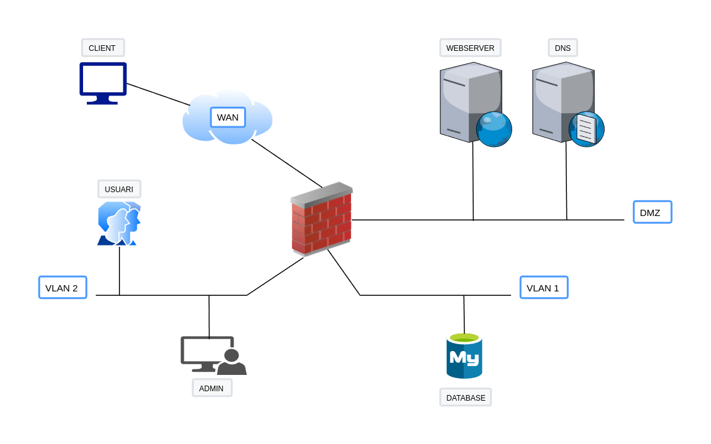

## Descripción del escenario

Para esta práctica vamos a suponer un escenario que bien podría tratarse de un escenario real. La infraestructura de red que nos encontraremos es la siguiente:



1. En la **DMZ** encontramos un servidor web y otro servidor DNS.

    + El servidor web es para uso externo e interno, es decir, debe ser accesible tanto desde internet (WAN) como desde los usuarios internos de nuestra empresa. Se trata de un e-comerce en php que hace uso de una base de datos MYSQL, a partir de la cual muestra los productos en el portal. 
   + El servidor DNS es para uso exclusivamente interno, esto es, por parte de nuestros empleados. Se trata de un forwarder, esto quiere decir que su función será recibir las peticiones DNS y redirigirlas a otro servidor, por lo que debe tener salida al exterior.
  
2. En la **VLAN1** encontramos la base de datos MySQL de la que hace uso el servidor web. Está en otra subred por temas de seguridad.
3. La **VLAN2** es la subred donde se hallan nuestros empleados de la empresa. Entre ellos también se sencuentra el administrador de sistemas.
4. La **WAN** es la interfaz externa de nuestra empresa, o lo que es lo mismo, Internet. Hay ubicado un usuario *client* para realizar nuestras pruebas. Este usuario únicamente debe poder consultar el servidor web.

## Cómo levantar el escenario

!!!warning " "
    Debéis tener instaladas las últimas versiones tanto de Docker como de Docker Compose.

Los pasos para ejecutar el escenario y comenzar a trabajar son:

1. Clonar [este repositorio](https://github.com/raul-profesor/nftables).
2. Tenemos dos archivos docker-compose, uno se encarga de crear las redes necesarias y otro para crear los contenedores mismos. Tenemos dos opciones para ejecutar:
   
     1. Este comando:
            ```bash
            docker-compose up -f docker-compose-networks.yml -f docker-compose.yml up -d
            ```
     2. Para no tener que especificar los dos archivos siempre que queremos levantar el escenario, podemos utilizar una variable de entorno:
            ```bash
            export COMPOSE_FILE=docker-compose-networks.yml:docker-compose.yml
            ```
            Y después ya ejecutar el comando de siempre:
            ```bash
            docker-compose up -d
            ```
            Y en breves instantes tendremos nuestros 7 contenedores y todas las redes creadas y a punto para empezar a trabajar. Podéis comprobarlo con `docker ps`.

3. Los contenedores contienen todas las herramientas necesarias para la práctica.

## Condiciones que se deben cumplir en el escenario 

1. **Sólo** el admin debe tener acceso por SSH al firewall
2. Todos los usuarios de VLAN2 deben tener acceso al servidor web y al dns.
3. **Sólo** el admin y el servidor web deben tener acceso a la base de datos por el puerto por defecto de MySQL.
4. Los usuarios que entren por la interfaz WAN sólo deben tener acceso al servidor web
5. El servidor debe tener acceso al exterior para hacer *forwarding* de las peticiones
6. Todos los usuarios de la VLAN2 deben poder hacer ping los servidores de la DMZ
7. **Sólo** el admin debe poder hacer ping al servidor de base de datos

## Configuración de *nftables*

Para realizar la configuración, nos crearemos un script en bash para ejecutarlo y que se cargue nuestra configuración. Este script comenzará así:

```bash
#!/usr/sbin/nft -f

flush ruleset
```
El shebang de la primera línea indica que será ejecutado por *nftables* y de esta forma cada línea del script puede omitir el comienzo de la orden (nft). 

La segunda línea borrará la configuración actual de *nftables* antes de seguir ejecutando las órdenes que hayamos configurado en el mismo.

Después continuaremos elaborando nuestro script por pasos:

1. Crearemos dos tablas, una llamada *filtrat* y otra *nat*. Como es obvio, la primera se encargará del filtrado de paquetes y la segunda de realizar las traducciones nat. 
    Para esto os podéis ayudar de [los apuntes](http://raul-profesor.github.io/SAD/firewall/#implementacion-practica-con-nftables)
2. Crearemos tres cadenas para la tabla **filtrat** (input, output y forward) con política por defecto *drop* y una cadena para la tabla **nat** (prerouting) sin indicarle política por deffecto.
    Para esto también os podéis ayudar de los apuntes del punto anterior.
3. Debemos crear una regla que vigile el estado de las conexiones para permitir los paquetes que pasen a través del firewall y que pertenezcan a una conexión previamente establecida o estén relacionados con ella.
    Consultad información sobre el seguimiento del estado de la conexión o [*connection tracking state*](https://wiki.nftables.org/wiki-nftables/index.php/Matching_connection_tracking_stateful_metainformation) en nftables.

    !!!tip "Pista"
        Para las siguientes reglas, podéis consultar su sintaxis en [la wiki de nftables](https://wiki.nftables.org/wiki-nftables/index.php/Quick_reference-nftables_in_10_minutes)

4. Crear una regla que permita los paquetes que pasen a través del firewall, que entren desde la interfaz de la VLAN2, con dirección origen la de red de VLAN2, dirección destino la dirección de red de la DMZ, protocolo icmp (para el ping) y tipo de mensaje icmp `echo-request`y `echo-reply`.
5. Crear una regla que permita los paquetes que pasen a través del firewall, que entren por la interfaz VLAN1, con ip destino la del servidor web, puerto destino el 80 TCP.
6. Crear una regla que permita los paquetes que pasen a través del firewall, que entren por la interfaz de la VLAN2, ip destino la del servidor DNS, puerto destino el 53 UDP.
7. Crear una regla que permita los paquetes que pasen a través del firewall, que entren por la interfaz de la DMZ, interfaz de salida la de la DMZ, ip origen la del servidor DNS, puerto destino el 53 UDP.
8. Crear una regla que permita los paquetes que pasen a través del firewall, con interfaz de entrada la DMZ, interfaz de salida la de VLAN1, ip origen del servidor web, ip destino la de la base de datos y puerto destino el 3306 TCP.
9. Crear una regla que permita los paquetes que pasen a través del firewall, con interfaz de entrada la VLAN2, interfaz de salida la de VLAN1, ip origen la del *admin*, ip destino la de la base de datos y puerto destino el 3306 TCP.
10. Crear una regla que permita las conexiones de entrada al firewall en la interfaz de entrada de la VLAN2, con ip origen la del admin e ip destino la del firewall en esa interfaz, puerto destino el correspodiente a SSH y TCP.
11. Crear una regla de salida del tipo *connection tracking state* para permitir la salida de paquetes de conexiones previamente establecidas o relacionadas.
12. Por último, crear una regla de NAT, de tipo prerouting cuyo cometido será realizar una traducción NAT de todo lo que entre por la interfaz WAN a la ip destino la del firewall, con puerto destino 8080, hacia la dirección del servidor web y puerto 80.

!!!note "Nota"
    Todas las reglas deben configurarse con contadores.

    Estos contadores mostrarán la cantidad de paquetes que han hecho *match* de cada regla cuando listemos la configuración.

!!!tip "Consejos"
    + Todas las IPs las tenéis en el archivo de variables de entorno para docker-compose.
    + Para un mayor orden y facilidad a la hora de crear las reglas en el script os recomiendo después del *flush* inicial definir variables para cada IP y nombre de interfaz que vayáis a utilizar.
    + Para saber el nombre de qué interfaz del firewall está conectada a qué red, haced uso del comando `ip a`. Las interfaces tienen este formato `ethx@ifxx`. Para cualquer cosa para la que necesitéis el nombre de la interfaz, debéis utilizar únicamente el `ethx`.
    + Puesto que configuraréis reglas que consideraréis infalibles y fallarán, para saber exactamente que está pasando **ser recomienda encarecidamente el uso de tcpdump**:
  
        `tcpdump -nvi <nombre interfaz>`

!!!task "Tarea"
    Realiza las comprobaciones para comprobar que se cumplen [las premisas](http://raul-profesor.github.io/SAD/nftables/#condiciones-que-se-deben-cumplir-en-el-escenario) que hemos establecido a la hora de configurar las reglas.

    Si las comprobaciones están bien, las conexiones necesarias se establecerán sin problemas y las que no, se cortarán. Muestra una captura donde se vean cómo se produce la conexión o el *drop*. También adjunta una captura del listado de las reglas donde se vea que todas tienen los contadores mayor que 0.
