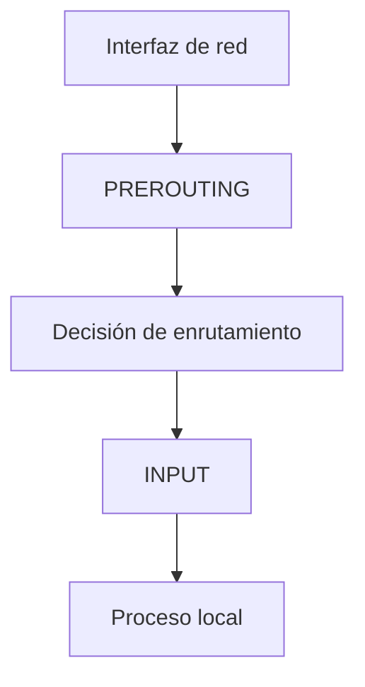
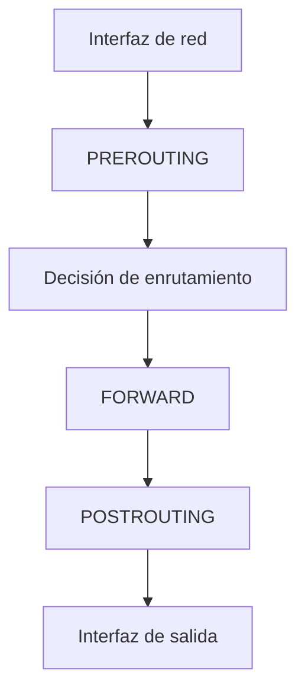
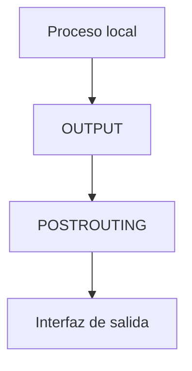
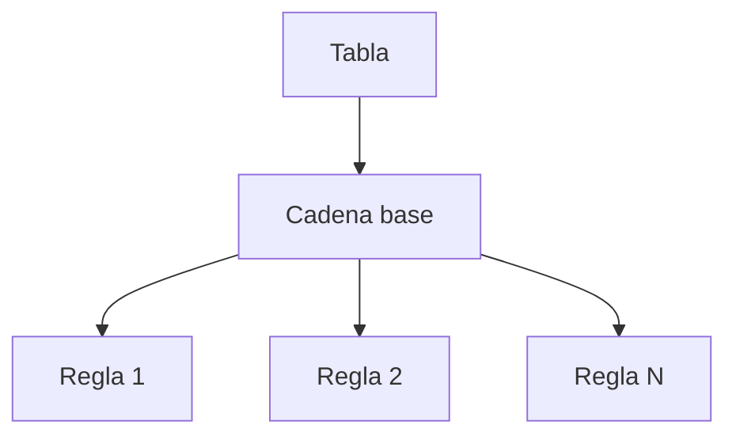
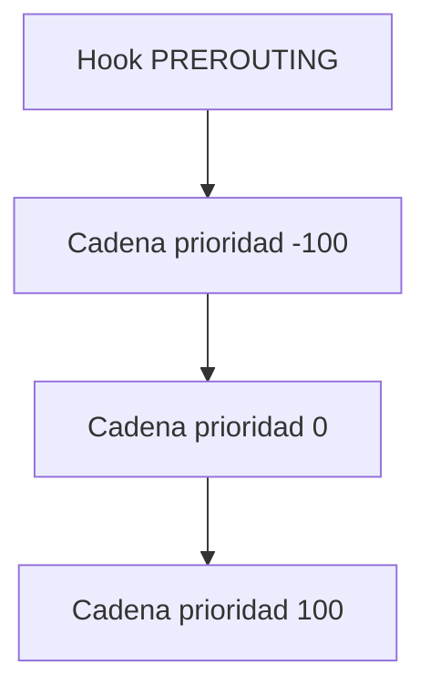
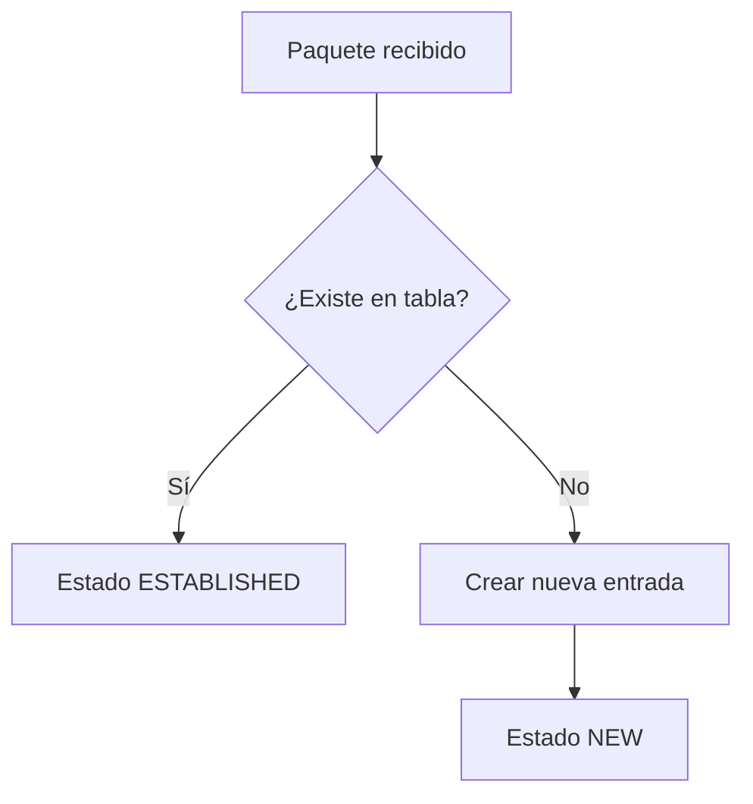
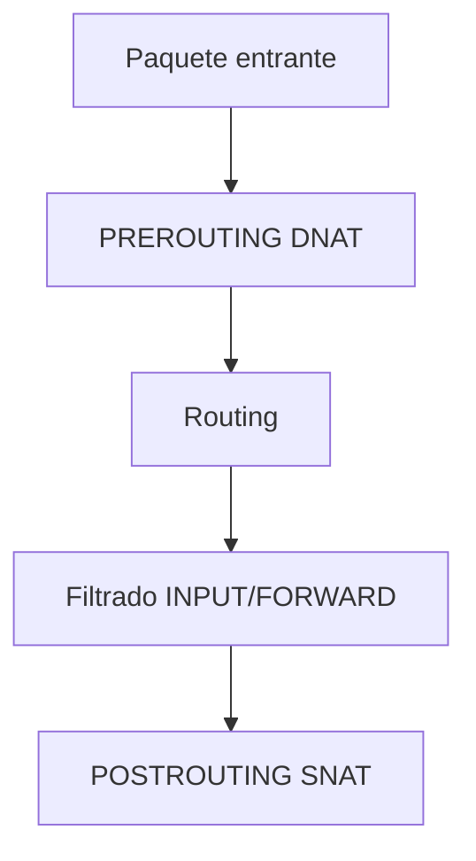

# Fundamentos Teóricos Avanzados de Firewalls en Linux y nftables

## 1. Arquitectura general del firewall en Linux

En Linux, el firewall no es una aplicación externa que analiza tráfico desde espacio de usuario. Es un mecanismo integrado en el kernel que intercepta paquetes en puntos concretos del procesamiento del stack de red.

El componente central es Netfilter, un framework del kernel que introduce puntos de intervención dentro del flujo interno de paquetes. Esos puntos permiten registrar funciones que inspeccionan, modifican, aceptan o descartan tráfico.

La herramienta `nftables` no es el firewall en sí. Es la interfaz que permite definir reglas que el kernel almacenará y ejecutará dentro de Netfilter.

Arquitectura simplificada:

- Kernel Linux
  - Stack TCP/IP
  - Netfilter (hooks)
  - Conntrack (seguimiento de conexiones)
- Espacio de usuario
  - Comando `nft`

Las reglas configuradas mediante `nft` se traducen en estructuras internas que el kernel evalúa para cada paquete que atraviesa el sistema.

Comprender esta separación entre espacio de usuario y kernel es esencial para no confundir herramienta con motor.

## 2. Recorrido completo de un paquete dentro del sistema

Para entender nftables desde cero es obligatorio entender qué ocurre cuando un paquete entra o sale del sistema.

Cuando un paquete llega por una interfaz de red:

1. El driver de red lo recibe.
2. Se entrega al stack IP.
3. Se ejecutan funciones internas del kernel.
4. En puntos concretos, Netfilter intercepta el paquete.

Dependiendo del destino, el recorrido cambia.

### 2.1 Tráfico entrante destinado al propio host



### 2.2 Tráfico que atraviesa el sistema (modo router)



### 2.3 Tráfico generado localmente



Estos puntos PREROUTING, INPUT, FORWARD, OUTPUT y POSTROUTING son los hooks.

## 3. Hook: definición técnica y funcionamiento

Un hook es un punto fijo del código del kernel donde Netfilter permite registrar funciones que serán ejecutadas cuando un paquete alcance ese punto del flujo.

Los hooks están definidos en el kernel. No se crean dinámicamente.

Hooks principales:

- PREROUTING
- INPUT
- FORWARD
- OUTPUT
- POSTROUTING

Cada hook representa un momento exacto en el ciclo de vida del paquete:

- PREROUTING ocurre antes de que el kernel decida a qué interfaz debe enviarse el paquete.
- INPUT ocurre después de determinar que el destino es el propio sistema.
- FORWARD ocurre cuando el sistema actúa como router.
- OUTPUT ocurre para paquetes creados por procesos locales.
- POSTROUTING ocurre justo antes de que el paquete abandone el sistema.

Un hook no contiene reglas. Es solo un punto donde pueden asociarse cadenas.

## 4. Tabla y cadena: estructura jerárquica

En nftables, las reglas no cuelgan directamente del hook. Existe una jerarquía:

- Tabla
  - Cadena
    - Reglas

Representación conceptual:



La tabla es un contenedor lógico. Organiza reglas según familia (ip, ip6, inet) o propósito (filter, nat).

La cadena es el conjunto ordenado de reglas que se ejecuta cuando un paquete alcanza el hook al que está asociada.

## 5. Cadena base

Una cadena base está vinculada a:

- Un hook
- Una prioridad
- Una política por defecto

Cuando el paquete llega al hook, el kernel ejecuta las cadenas asociadas a ese hook.

Si existen varias cadenas en el mismo hook, se ejecutan según su prioridad.

La cadena base es el punto real donde se toma la decisión de permitir o bloquear tráfico.

## 6. Cadena regular

Una cadena regular no está asociada a ningún hook.

Se utiliza como bloque auxiliar que puede ser invocado mediante:

- jump
- goto

Conceptualmente, equivale a una función en programación estructurada.

Permite modularizar reglas complejas y evitar duplicación.

## 7. Orden de evaluación de reglas

Dentro de una cadena, las reglas se evalúan secuencialmente.

Proceso interno simplificado:

1. Se evalúa la primera regla.
2. Si la condición coincide y la acción es terminal (accept, drop), la evaluación se detiene.
3. Si no coincide, se continúa con la siguiente.
4. Si ninguna regla coincide:
   - En cadena base: se aplica la política.
   - En cadena regular: se retorna a la cadena llamadora.

El orden es absolutamente determinista.

## 8. Política: fundamento del modelo de seguridad

La política es la acción por defecto aplicada cuando ninguna regla coincide en una cadena base.

Valores habituales:

- accept
- drop

La política define la postura de seguridad del sistema.

Modelo permisivo:

- Política accept
- Todo permitido salvo lo bloqueado explícitamente
- Alto riesgo de omisiones

Modelo restrictivo:

- Política drop
- Todo bloqueado salvo lo permitido explícitamente
- Modelo recomendado en producción

Un firewall profesional se diseña siempre bajo el principio de mínimo privilegio.

## 9. Prioridad: orden real cuando existen múltiples cadenas

Un mismo hook puede tener varias cadenas base asociadas.

Cada cadena tiene una prioridad numérica.

El kernel ejecuta las cadenas en orden creciente de prioridad.

Ejemplo conceptual:



Esto permite separar:

- NAT (normalmente prioridad más baja)
- Filtrado
- Otras manipulaciones

La prioridad es crucial para entender por qué ciertas transformaciones ocurren antes que otras.

## 10. Conntrack: firewall con estado

Sin seguimiento de conexiones, el firewall sería stateless.

Conntrack mantiene una tabla interna de conexiones activas.

Estados principales:

- NEW
- ESTABLISHED
- RELATED
- INVALID

Flujo conceptual de conntrack:



Gracias a conntrack, el firewall puede:

- Permitir automáticamente respuestas de conexiones iniciadas desde dentro.
- Bloquear paquetes inválidos.
- Aplicar reglas distintas según el estado.

Esto convierte al firewall en stateful.

## 11. NAT: transformación de paquetes

NAT no decide si el paquete se acepta o no. Modifica direcciones.

Tipos:

- SNAT: modifica IP origen.
- DNAT: modifica IP destino.
- Masquerade: SNAT dinámico.

Ubicación típica:

- DNAT en PREROUTING.
- SNAT en POSTROUTING.

Representación simplificada:



Es fundamental entender que el filtrado puede ocurrir después de que la dirección haya sido modificada.

## 12. Modelo mental que debe interiorizar el alumno

Antes de escribir reglas se deben poder responder con precisión técnica:

- ¿El paquete entra o sale?
- ¿Está destinado al host o lo atraviesa?
- ¿En qué hook se interceptará?
- ¿Necesito filtrar o modificar direcciones?
- ¿Qué ocurre si ninguna regla coincide?
- ¿Estoy utilizando estado de conexión?
- ¿En qué orden se ejecutarán las cadenas si hay varias?

Estas preguntas son clave para entender el funcionamiento interno del firewall.

## 13. Conclusión estructural y resumen

Un firewall basado en nftables se compone de:

- Tablas como contenedores lógicos
- Cadenas base asociadas a hooks
- Reglas evaluadas secuencialmente
- Política por defecto
- Sistema de prioridades
- Seguimiento de conexiones (conntrack)
- Separación entre NAT y filtrado

Dominar estos conceptos es imprescindible antes de realizar cualquier práctica de configuración.

## 14. Nftables

### 14.1 **Reglas (Rules)**:

Las reglas de un firewall definen las condiciones bajo las cuales el tráfico es permitido o denegado. Las reglas son evaluadas en orden, y el tráfico se compara contra ellas para decidir si es permitido o no. Las reglas típicamente contienen:

- Dirección de origen y destino (dirección IP).

- Puertos de origen y destino.

- El protocolo utilizado (TCP, UDP, ICMP, etc.).

- La acción (permitir o bloquear).

### 14.2 **Cadenas (Chains)**:

Las cadenas son las secuencias de reglas que un firewall aplica al tráfico entrante y saliente. Una cadena define cómo se debe manejar el tráfico según su dirección (entrada, salida o tránsito) o su tipo. Por ejemplo:

- `INPUT`: Controla el tráfico que entra al sistema.

- `OUTPUT`: Controla el tráfico que sale del sistema.

- `FORWARD`: Controla el tráfico que pasa a través del sistema, pero no está destinado al propio sistema.

### 14.3 **Tablas (Tables)**:

Las tablas son contenedores que agrupan las cadenas. En Linux, las tablas más comunes son:

- **filter**: Para el filtrado de tráfico (reglas de firewall).

- **nat**: Para la manipulación de direcciones de red (como NAT y port forwarding).

- **mangle**: Para modificar los paquetes de red.

- **raw**: Para configuraciones de bajo nivel, como habilitar o deshabilitar la conexión de seguimiento de estado.

### 14.4 **Políticas Predeterminadas (Default Policies)**:

Si un paquete no coincide con ninguna regla en una cadena, se aplica la política predeterminada de la cadena. Las políticas predeterminadas pueden ser de dos tipos:

- `ACCEPT`: Permitir el tráfico.

- `DROP`: Bloquear el tráfico sin notificar.

---

## 15 **Implementación Práctica con nftables**

**nftables** es la herramienta moderna para gestionar firewalls en Linux. A partir del kernel 3.13, **nftables** reemplazó a **iptables**, **ip6tables**, **arptables** y **ebtables**. Su objetivo es unificar y simplificar la configuración de firewalls en sistemas Linux.

### **Pasos Básicos para Usar nftables**

### 15.1 **Comprobar si nftables está disponible**:

Antes de empezar, asegúrate de que nftables esté instalado y habilitado. Para ver si está en uso, puedes usar el siguiente comando:

```bash

sudo nft list ruleset

```

Este comando te mostrará las reglas actuales que se están aplicando en el sistema.

### 15.2 **Crear una tabla de filtrado**:

Las tablas contienen las cadenas y reglas. Para crear una tabla de filtrado, usamos el siguiente comando:

```bash

sudo nft add table ip filter

```

Esto crea una tabla llamada `filter` para IPv4. Si estás trabajando con IPv6, se usaría `ip6`.

### 15.3 **Crear una cadena**:

Ahora, vamos a crear una cadena dentro de la tabla `filter` para controlar el tráfico de entrada:

```bash

sudo nft add chain ip filter input { type filter hook input priority 0 \; }

```

En este caso, estamos creando la cadena `input`, que se engancha al "hook" de entrada. La opción `priority 0` especifica la prioridad de la cadena.

### 15.4 **Añadir reglas de filtrado**:

Ahora podemos agregar reglas para controlar el tráfico que entra al sistema. Por ejemplo:

- Permitir tráfico desde una IP específica:

```bash
sudo nft add rule ip filter input ip saddr 192.168.1.1 accept

```

- Bloquear tráfico desde una IP específica:

```bash
sudo nft add rule ip filter input ip saddr 10.0.0.1 drop
```

- Permitir tráfico HTTP y SSH:

```bash
sudo nft add rule ip filter input tcp dport {22, 80} accept
```

- Rechazar todo el tráfico entrante por defecto:

```bash
sudo nft add rule ip filter input drop
```

### 15.5 **Ver las reglas configuradas**:

Para revisar las reglas que has configurado, puedes utilizar el siguiente comando:

```bash
sudo nft list ruleset
```

Este comando te mostrará todas las tablas, cadenas y reglas configuradas en el sistema.

### 15.6 **Guardar las reglas**:

Para asegurarte de que las reglas se apliquen después de un reinicio, debes guardarlas en un archivo:

```bash
sudo nft list ruleset > /etc/nftables.conf
```

Luego, para restaurarlas al reiniciar el sistema, puedes usar:

```bash
sudo nft -f /etc/nftables.conf
```

#### **Ejemplo Completo de Configuración de un Firewall Básico con nftables**

Imagina que quieres crear un firewall básico con las siguientes reglas:

- Permitir todo el tráfico desde la red interna (192.168.1.0/24).

- Bloquear todo el tráfico desde la IP 10.0.0.1.

- Permitir tráfico HTTP (puerto 80) y SSH (puerto 22).

- Denegar todo el tráfico por defecto.

Los comandos serían:

```bash
# Esborrar regles anteriors

sudo nft flush ruleset

# Crear la tabla de filtrado

sudo nft add table ip filter

# Crear la cadena de entrada

sudo nft add chain ip filter input { type filter hook input priority 0 \; policy drop \; }

# Crear cadena per a permetre el pas de tràfic a través del firewall

sudo nft add chain ip filter forward { type filter hook forward priority 0 \; policy drop \; }

# Crear la cadena de entrada d'eixida
 
sudo nft add chain inet my_table output { type filter hook output priority 0 \; policy accept \; }


# Permitir tráfico desde la red interna

sudo nft add rule ip filter input ip saddr 192.168.1.0/24 accept

# Bloquear tráfico desde la IP 10.0.0.1

sudo nft add rule ip filter input ip saddr 10.0.0.1 drop

# Permitir tráfico HTTP y SSH

sudo nft add rule ip filter input tcp dport {22, 80} accept

# Ver las reglas configuradas

sudo nft list ruleset

# Guardar las reglas

sudo nft list ruleset > /etc/nftables.conf
```

Con estos pasos, habrás configurado un firewall básico usando **nftables** que protege tu sistema de accesos no deseados.

---