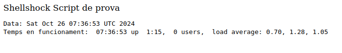

## Què és Shellshock?
Shellshock és una vulnerabilitat de seguretat que afecta Bash, un intèrpret de comandes molt utilitzat en sistemes Unix i Linux, encara que també en alguns sistemes macOS. Aquesta vulnerabilitat, descoberta el 2014, permet que un atacant executi ordres no autoritzades en un sistema afectat, comprometent-ne la seguretat.
Com funciona Shellshock?

La vulnerabilitat de Shellshock permet a un atacant injectar codi maliciós a variables d'entorn. Bash, quan trobeu una variable d'entorn que conté codi, podeu executar aquest codi, la qual cosa obre una porta perquè un atacant controli remotament el sistema. Aquesta execució remota d'ordres passa quan el sistema utilitza Bash per interpretar variables d'entorn, com ara aplicacions web, scripts CGI o qualsevol altre sistema que passi informació a través de variables.

### Impacte i abast de Shellshock


Shellshock és una vulnerabilitat crítica perquè:

+ **És fàcil d'explotar:** Amb unes quantes ordres, un atacant pot executar codi maliciós.
+ **És difícil de detectar:** Molts sistemes antics o mal mantinguts encara utilitzen versions de Bash vulnerables, per la qual cosa és un blanc fàcil per a atacs.
Podeu atorgar accés complet: Un atacant podria comprometre servidors complets, accedir a bases de dades, robar informació o instal·lar codi maliciós.

### Com es va mitigar Shellshock

Quan Shellshock va ser descobert, els desenvolupadors i administradors de sistemes van treballar per actualitzar Bash, i la comunitat de seguretat va emetre pegats per tancar aquesta vulnerabilitat. Aplicar aquests pegats i actualitzar a versions de Bash corregides és fonamental per prevenir atacs que aprofitin aquesta vulnerabilitat.

## Realització de la pràctica

Per a aquesta pràctica farem servir una imatge Docker d'una versió antiga d'Ubuntu, on instal·larem una versió vulnerable de Bash. Això simularà d'alguna manera un cas real d'una empresa on encara es conservin sistemes antics desactualitzats i ens farà prendre consciència del perill.

El primer que necessitem sens dubte és tenir Docker instal·lat al nostre sistema Rocky. Per això podem seguir qualsevol guia, com ara la [documentació oficial de Rocky](https://docs.rockylinux.org/gemstones/containers/docker/). 

!!!warning "Atenció"
    **Assegureu-vos, seguint la guía d'instal·lació, de que podeu executar Docker sense `sudo`**.

Haureu de crear un directori i dins d'ell, els dos arxius que es detallen a continuació. El Dockerfile a partir del qual es crearà la imatge és el següent:

```Dockerfile title="Dockerfile"
# Versió desactualitzada d'Ubuntu
FROM ubuntu:14.04

# Instal·lar dependències per instal·lar després una versió vulnerable de Bash
RUN apt-get update && \
    apt-get clean &&\
    apt-get install -y build-essential wget

RUN wget https://snapshot.debian.org/archive/debian/20140304T040604Z/pool/main/b/bash/bash_4.1-3_amd64.deb
RUN dpkg -i bash_4.1-3_amd64.deb

# Copiem un petit script al directori adequat perquè sigui servit per Apache
RUN mkdir -p /usr/lib/cgi-bin
COPY prova_shellshock.sh /usr/lib/cgi-bin/prova_shellshock.sh
RUN chmod +x /usr/lib/cgi-bin/prova_shellshock.sh

# Instal·lem Apache i el mòdul adequat per a scripts CGI
RUN apt-get install -y apache2 && \
    a2enmod cgi && \
    service apache2 restart

# Iniciem Apache
CMD ["apachectl", "-D", "FOREGROUND"]
```

El contingun de l'script que servirà Apache és:

```bash title="prova_shellshock.sh"
#!/bin/bash
echo "Content-type: text/html"
echo ""
echo "Shellshock Script de prova"
echo "<pre>"
echo "Data: $(date)"
echo "Temps en funcionament: $(uptime)"
echo "</pre>"
```

Construïm la imatge Docker a partir del Dockerfile situant-nos en el directori a on està ubicat el fitxer:

```bash
docker build -t prova_shellshock .
```
I si tot ha anat bé, apareixerà llistada:

```bash
docker images
```

Ara pasem a executar el contenidor a partir de la imatge:

```bash
docker run -d -p 8080:80 --name practica_desactualitzat_shellshock prova_shellshock
```

I es quedarà executant-se en background, podeu comprovar-lo amb:

```bash
docker ps
```

Ara si en el vostre navegador accediu a `http://IP-Rocky:8080/cgi-bin/prova_shellshock.sh`hauria d'executar-se l'script i vore algo com:



I ja tindríem el nostre escenari preparat. Ara es el vostre torn:

1. Investiga com pots comprovar que el sistema es vulnerable a Shellshock:
      1. Fes-lo primer amb el comandament `curl`
      2. Fes-lo després amb `nmap`i l'script `.nse`adequat
2. Quan ja hem certificat per duplicat que el sistema és vulnerable, investiga com aplicar el parxe al sistema
3. Torna a comprovar si el sistema és vulnerable i certifica l'éxit del parxe

!!!tip "Ajuda"
    Per poder ficar-nos dins del contenidor Ubuntu que hem creat i utilitzar la seua línia de comandaments, podem fer servir el comandament:

    ```bash
    docker exec -it practica_desactualitzat_shellshock /bin/bash
    ```