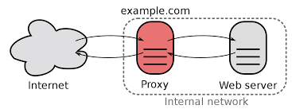

## ¿Qué es Caddy?
Caddy 2 es un potente servidor web de código abierto desarrollado haciendo uso del lenguaje de programación Go.

Simplifica la infraestructura a montar y se encarga de forma automática de las renovaciones de certificados SSL para los sitios web. Aunque comunmente se usa como servidor web o proxy, también se podría utilizar para otras funciones:

+ Proxy sidecar
+ Balanceador de carga
+ Puerta de enlace API
+ Control de ingreso 


{: style="height:200px;width:250px"}


Es una aplicación con un enfoque más clásico que [Traefik](https://raul-profesor.github.io/SAD/proxy-traefik/) y sí tiene ficheros de configuración. Pero al mismo tiempo está pensado para ser muy simple, y gestionar automáticamente y por defecto cosas que en otro servidores web habría que hacer de forma explícita.

## ¿Cómo funciona Caddy?

Un proxy inverso es un intermediario entre los dispositivos cliente y los servidores web, administrando las peticiones y respuestas con el fin de mejorar la seguridad, el rendimiento y la flexibilidad.

 

Caddy permite:

+ Configuración SSL/TLS automática: Caddy se integra sin problemas con Let's Encrypt de tal forma que es capaz de obtener y renovar de forma automática los certificados SSL/TLS para HTTPS, asegurando siempre una comunicación segura.
    También incluye y configura automáticamente unos certificados autofirmados para entornos locales o de desarrollo.

+ Configuración mediante un archivo llamado ***Caddyfile***, haciéndolo muy simple.
+ Soporte para los nuevos protocolos HTTP/2 y QUIC 
+ Monitorización y métricas en tiempo real, compatibles con sistemas de monitorización como **Prometheus**.
+ Middleware y extensiones: Caddy permite, haciendo uso de plugins, añadir funcionalidades interesantes a la aplicación


## Objetivo de la práctica

El objetivo de esta práctica será configurar un contenedor Docker de *Caddy* como proxy inverso para apliciaciones web, también desplegadas en contenedores Docker. Además, Caddy utilizará certificados autofirmados para que el acceso a las aplicaciones web se efectúe de forma segura mediante HTTPS.

## Realización

Dado el siguiente archivo donde se despliegan los elementos necesarios:

```yaml title="compose.yaml"
#-----------------------------------------------------------------------------------------------
# ! Este archivo docker compose es apto para entornos locales o de desarrollo, no de producción. 
#-----------------------------------------------------------------------------------------------


# Nombre del proyecto
name: docker-reverse-proxy

# Servicios Docker.
services:
  # Contenedor de Caddy
  caddy:
    # https://hub.docker.com/_/caddy
    image: caddy:alpine
    container_name: ${CONTAINER_NAME:-reverse_proxy}
    restart: unless-stopped
    networks:
      - reverse_proxy
    # Mapea los puertos expuestos en las aplicaciones a los puertos del host o máquina anfitrión
    ports:
      - 80:80
      - 443:443
      - ${ADMIN_API_PORT:-2019}:2019
    volumes:
      - caddy_data:/data
      - caddy_config:/config
    # Archivo de configuración de Caddy
      - $PWD/config/Caddyfile:/etc/caddy/Caddyfile
    # Autoridad de certificación (CA) de Caddy
      - $PWD/certificate-authority:/data/caddy/pki/authorities/local

  # Aplicación web de prueba con nginx
  website:
    image: "nginxdemos/hello"
    container_name: app_demo
    # Correspondencia entre puerto utilizado por el contenedor y el accesible desde el anfitrión
    ports:
    - 8080:80
    networks:
      - reverse_proxy

# Redes de Docker
networks:
  reverse_proxy:
    external: true
      
# Volúmenes de Docker
volumes:
  caddy_data:
    driver: "local"
    name: "${CONTAINER_VOLUME_DATA_NAME:-reverse_proxy_data}"
  caddy_config:
    driver: "local"
    name: "${CONTAINER_VOLUME_CONFIG_NAME:-reverse_proxy_config}"
```

Se requiere modificar el archivo de configuración Caddyfile:

```linuxconf
#--------------------------------------------------------------------------
# Caddy configuration
# https://caddyserver.com/docs/caddyfile/options
#--------------------------------------------------------------------------

{
  debug
  local_certs
  auto_https disable_redirects
  admin 0.0.0.0:2019
}

#--------------------------------------------------------------------------
# Reverse proxy
# https://caddyserver.com/docs/caddyfile/directives/reverse_proxy
#--------------------------------------------------------------------------

# Aquí se configura el acceso HTTP al contenedor de la aplicación web
# También se debe configurar para que el acceso http sea redirigido automáticamente al bloque de https

# Bloque HTTP

________:____ {
  redir ___________
}

# Bloque HTTPS

________:_____ {
  tls internal
  reverse_proxy _____

}

```

Para que:

+ En el primer bloque, se tenga acceso HTTP a la aplicación
    +  Pero se haga una redirección al bloque de HTTPS
+ En el segundo bloque esté configurado el acceso HTTPS
    + Realizando las labores de proxy inverso, se redirija la petición a la aplicación en cuestión

!!!warning "Atención"
    Caddy tiene utiliza un DNS interno que es capaz de resolver los nombres de los contenedores, por lo que, aunque se podría, no hace falta utilizar IPs para nada en la configuración.

!!!task "Tarea"
    + Investiga el funcioamiento de este archivo de configuración y complétalo tal y como se solicita par hacerlo funcionar
    + Comprueba con tu navegador que funciona correctamente:
        + Al acceder por http se te redirige a https
        + La primera vez que accedas dará una alerta de seguridad al ser un certificado autofirmado, dadle a aceptar el riesgo 

### Redirección automática de HTTP a HTTPS

De alguna forma, en el apartado anterior hemos realizado esta redirección a una comunicación segura de forma *manual*. No obstante, la sencillez de **Caddy** hace que el mismo proxy realice esta redirección de forma automática, si nuestra intervención, a menos que nosotros le digamos lo contrario.

!!!task "Tarea"
    + Elimina el bloque completo de HTTP del archivo ***Caddyfile***, dejando únicamente el de HTTPS
    + Investiga que opción de configuración del archivo ***Caddyfile*** debemos eliminar para que se realice la redirección automáticamente
    + Comprueba que funciona correctamente

!!!task "Tarea"
    + En el `compose.yaml` añade una nueva aplicación, como por ejemplo [esta](https://github.com/dennisMeeQ/juice-shop) y configúrala de la misma forma que la anterior.


### Para nota

Caddy puede funcionar también de la misma forma que lo hace [*Traefik*](https://raul-profesor.github.io/SAD/proxy-traefik/), usando etiquetas (*labels*) en el `compose.yml`. Para ello utiliza un plugin que se denomina `caddy-docker-proxy`.

!!!task "Tarea"
    Investiga esta opción y realiza de nuevo la práctica anterior mediante *labels* en lugar de utilizar el archivo de configuración *Caddyfile*


## Referencias

[Proxy Inverso con Caddy](https://ugeek.github.io/blog/post/2021-02-19-proxy-inverso-con-caddy.html)

[De Apache a Caddy](https://nosoyvagosoyeficiente.wordpress.com/2022/05/23/de-apache-a-caddy/)

[Create and build simple reverse proxy with Caddy1](https://alexhost.com/trust-and-security/create-and-build-simple-reverse-proxy-with-caddy1/)

[Caddy como proxy inverso pero muy fácil](https://atareao.es/tutorial/self-hosted/caddy-como-proxy-inverso-pero-muy-facil/)