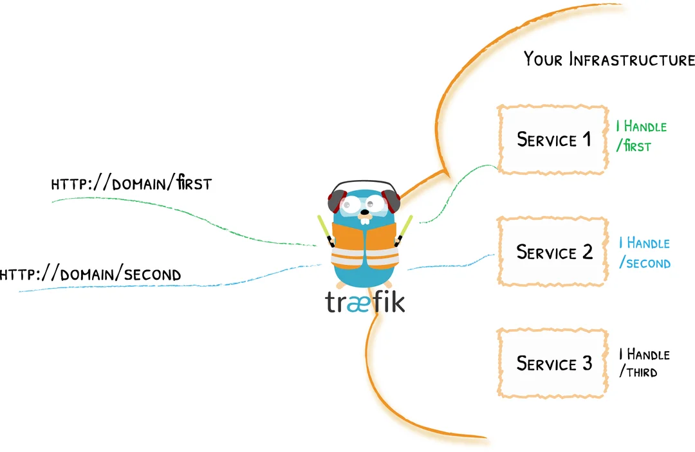
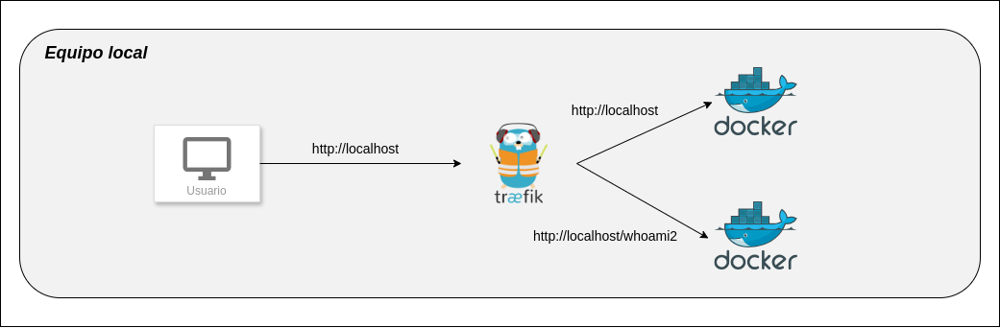

## ¿Qué es Traefik?

Respuesta rápida: Traefik es un proxy inverso y balanceador de carga que se integra nativamente con Docker.

De forma un poco más completa, Traefik actúa como router, interceptando y enrutando todas las solicitudes entrantes a los servicios del *backend* qué corresponda en cada caso. Esto es especialmente en entornos muy grandes con gran número de servicios o microservicios.

Una potente funcionalidad de Traefik es el hecho de realizar un descubrimiento dinámico de los servicios que debe enrutar. Si añadimos un nuevo servicio, sólo debemos añadir el endpoint adecuado para que Traefik se encargue de todo lo demás y lo deje funcionando correctamente.



Aunque existen [otras alternativas](https://raul-profesor.github.io/SXI/section/P4.5/) bastate potentes, útiles y conocidas, en este caso trataremos con una de las más populares para tener un ligero conocimiento de la misma.

## ¿Cómo funciona Traefik?

En [esta imagen](https://accesto.com/blog/static/61da49d156c5a646363d252c12f65ccf/3c492/traefik-components-overview.png) vemos meridianamente claro el funcionamiento de este *edge router* o router de frontera[^1], como es Traefik.

[^1]: Estos routers son dispositivos situados entre la red interna de y las redes de otros proveedores que intercambian el tráfico con nosotros y que se encargan de dirigir el tráfico de datos de una lado a otro.

De acuerdo con [la documentación oficial](https://doc.traefik.io/traefik/getting-started/concepts/) de Traefik:


+ Puntos de entrada: Los EntryPoints son los puntos de entrada de la red a Traefik. Definen el puerto que recibirá los paquetes y si escuchará TCP o UDP.

+ Enrutadores: Un router se encarga de conectar las peticiones entrantes con los servicios que pueden gestionarlas.

+ Middlewares: Adjuntos a los routers, los middlewares pueden modificar las peticiones o respuestas antes de que sean enviadas a su servicio

+ Servicios: Los servicios se encargan de configurar cómo llegar a los servicios reales que finalmente gestionarán las peticiones entrantes.


## Objetivo de la práctica

En esta práctica tendremos dos servicios, uno al que se accederá mediante la url `http://localhost`y otro mediante la url `http://localhost/whoami2`. Será *Traefik* el encargado de decidir hacia qué servicio o contenedor dirigirá la petición en base a esta url [^2].

[^2]: En un escenario real emplearemos nuestro propio dominio, como por ejemplo `http://este-es-mi-dominio.es`. Sin embargo, puesto que no tenemos ningún dominio registrado, utilizamos la dirección de nuestro equipo local.



Además, cada uno de los dos servicios estarán formados por más de una instancia o contenedor, por lo que el proxy inverso además de enrutar también realizará un balanceo de carga.

Una vez tengamos funcionando el escenario, utilizaremos otras funcionalidades del proxy.

## Realización

### Configuración de Traefik

Vamos a utilizar el siguiente archivo:

```yaml title="docker-compose.yml"
networks:
  red_traefik:
    driver: bridge
    ipam:
      config:
        - subnet: 172.24.0.0/24 #(5)

services:
  traefik:
    image: "traefik:v2.6"
    command:
      #- "--log.level=DEBUG"
      - "--api.insecure=__________" #(1)
      - "--providers.docker=______" #(2)
      - "--providers.docker.exposedbydefault=_______" #(3)
      - --providers.file.directory=/certificados
      - --providers.file.watch=true
      - "--entrypoints.____.address=____" #(4)
    ports:
      - "80:80"
      - "8080:8080"
    volumes:
      - "/var/run/docker.sock:/var/run/docker.sock:ro"
      - "./certificados:/certificados"
    networks:
      - red_traefik
```

1. Permite el acceso al panel de control web de Traefik. Sólo para escenarios de pruebas, debe deshabilitarse en producción.
2. Habilita el descubrimiento automático de configuraciones Docker
3. No exponer los servicios de Docker por defecto
4. Crea un *entrypoint* llamado **web** y que escucha en el puerto **80**
5. Dirección de subred en la que ubicaremos a nuestros contenedores/servicios

En la sección ***ports*** exponemos el puerto 80 para permitirel acceso al entrypoint **web** y el puerto 8080 es el puerto por defecto del panel de control web de Traefik.

Además, se necesita crear un volumen y conectarlo con *docker.sock* para que Traefik pueda comunicarse con el demonio de Docker y consultarle información acerca de los contenedores que estén corriendo en ese momento.

### Configuración de un servicio

Al anterior archivo `docker-compose.yaml` le añadiremos el siguiente servicio:

```yaml title="docker-compose.yml"
 whoami:
    image: "traefik/whoami"
    deploy:
        replicas: 3 # (4)
    labels:
      - "traefik.enable=_______" #(1)
      - "traefik.http.routers.whoami.rule=Host(`_______`)" #(2)
      - "traefik.http.routers.whoami.entrypoints=_______" #(3)
    networks:
      - red_traefik #(5)
```

1. Le decimos a Traefik que hay un servicio que queremos exponer
2. Aquí especificamos la regla que se debe cumplir para relacionar una petición concreta con este servicio (recuerda cuál es nuestro nombre de "dominio")
3. Aquí le decimos cuál de los entrypoint previamente configurados se debe usar para acceder a este servicio 
4. Desplegamos 3 instancias del servicio, para poder probar el balanceo de carga
5. Subred a la que pertenecerá el contenedor

### Configuración multiservicio y con coincidencia de ruta (patch matching)

Añadimos, a continuación de los anteriores, un nuevo servicio en el fichero `yaml`:

```yaml title="docker-compose.yml"
  whoami2: #(2)
    image: "nginxdemos/hello" #(1)
    deploy:
      replicas: 4 #(3)
    labels:
      - "traefik.enable=true"
      - "traefik.http.routers.whoami2.rule=Host(`_______`) && Path(`______`)" #(4)
      - "traefik.http.routers.whoami2.entrypoints=web"
    networks:
      - red_traefik #(5)
```

1. Utilizamos otra imagen de Docker, basada en Nginx que nos mostrará la IP del servidor al que se accede, además de permitir la recarga automática. Esto nos facilitará la comprobación del balanceo de carga.
2. Nombre de este nuevo servicio
3. Número de instancias a desplegar
4. Queremos que Traefik redirija nuestras peticiones a este servicio cuando accedamos a `http://localhost/whoami2`
5. Subred a la que pertenecerá el contenedor

!!!task "Tarea"
    Comprueba el correcto funcionamiento del escenario:

      1. Accede en tu navegador a `http://localhost`
          + Recarga varias veces la página para comprobar que cambia la IP del contenedor y se está produciendo el balanceo de carga.
      2. Accede ahora a `http://localhost/whoami2`, comprueba que funciona y marca la opción de recargar automáticamente. Comprueba que las peticiones se van repartiendo entre distintos contenedores.
   
    **Documenta detalladamente el proceso, indicando exactamente lo que estás comprobando.**
       

## Middleware

!!!task "Tarea"
    Investiga y explica brevemente <u>con tus palabras</u> cuál es la función concreta del middleware en Traefik y lista algunas de sus funciones.

### Lista blanca de IPs

En esta parte de la práctica vamos a hacer uso de esta función de middleware de Traefik. Fltraremos las IPs de origen que tendrán acceso a los servicios de tal forma qué:


[Busca información](https://doc.traefik.io/traefik/middlewares/http/ipwhitelist/) sobre cómo aplicar el filtrado de IP mediante las listas blancas en *Traefik* y completa el `docker-compose.yml` que ya teníamos con las líneas resaltadas, así como completa los huecos que hagan falta.

```yaml hl_lines="9-10" title="docker-compose.yml"
 whoami:
    image: "traefik/whoami"
    deploy:
        replicas: 3 
    labels:
      - "traefik.enable=_______" 
      - "traefik.http.routers.whoami.rule=Host(`_______`)" 
      - "traefik.http.routers.whoami.entrypoints=_______" 
      - "traefik.http.middlewares.whoami-filter-ip.ipwhitelist.__________=___________/24"
      - "traefik.http.routers.whoami.middlewares=______________"
    networks:
      - red_traefik
```
!!!task "Tarea"
      + Coloca una lista blanca en el servicio `whoami` para una dirección de subred diferente a la que estamos utilizando. Comprueba que al intentar acceder, obtienes el `403 forbidden` que se detalla en el esqumema de la imagen de arriba.
      + De la misma forma, coloca una lista blanca para el servicio `whoami2` que permite el acceso a la dirección de subred correcta y comprueba que puedes seguir accediendo sin problemas.

    Documenta y explica detalladamente el proceso que has seguido para completar el archivo `yaml`. 


### Autenticación básica

*Traefik* también nos ofrece la posibilidad de añadir una autenticación básica al acceso de los distintos servicios.

En este caso lo que vamos a hacer es suprimir del primer servicio, de `whoami` las líneas que hacen referencia a la lista blanca de IPs y añadiremos unas líneas que proporcionen una autenticación básica al servicio (la autenticación):

```yaml title="docker-compose.yml" hl_lines="7-8" 
 whoami:
    image: "traefik/whoami"
    labels:
      - "traefik.enable=true"
      - "traefik.http.routers.whoami.rule=Host(`__________`)"
      - "traefik.http.routers.whoami.entrypoints=_________"
      - "traefik.http.middlewares.whoami-auth._____________=raul:$$apr1$$CHKKEQyv$$/Fktitry1Az6rZNYADnDo." #(1)
      - "traefik.http.routers.whoami.middlewares=____________"
    networks:
      - red_traefik
```

1. Aquí debe ir vuestro usuario con vuestra contraseña generada, no pongáis el mío.

Para generar la contraseña, en el terminal podéis hacer:

```sh
echo $(htpasswd -nb vuestro_usuario vuestra_contraseña) | sed -e s/\\$/\\$\\$/g
```

Para ejecutar este comando en terminal os hará falta el paquete **apache2-utils**, si no lo tenéis instalado podéis hacerlo así:

```sh
sudo apt uptdate && sudo apt install apache2-utils
```

O similar, dependiendo del gestor de paquetes que uséis.

!!!task "Tarea"
    + Modifica el `docker-compose.yml` tal y como se indica, rellenando los nuevos huecos de las líneas resaltadas (los otros dos ya deberíais tenerlos completados de antes). 
    + Comprueba que se te solicita autenticación y que sólo eres capaz de acceder con la correcta
  
    Documenta y explica detalladamente el proceso que has seguido para completar el archivo `yaml`. 

!!!task "Tarea"
    Accede al *dashboard* de Traefik en `http://localhost:8080` e investiga la información mostrada en las distintas secciones. Explica qué significa lo que ves.

## Para nota

Otra función que puede realizar nuestro proxy inverso es la de asumir la responsabilidad de los certificados para ***https*** de nuestros servicios web, liberando así de esa carga a los propios servicios y unificando su administración en un único punto.

!!!task "Tarea para nota"
    Busca información sobre cómo utilizar certificados autofirmados en Traefik y configuralos para ambos servicios web.

    !!!tip "Pista"
        Deberás generar unos certificados y crear un archivo de configuración `.yml` para que Traefik sepa que debe utilizarlos.

        La primera vez que accedas a ambos servicios por https te saldrá un aviso de certificado no confiable, lo cual es normal al estar autofirmado, sólo debes aceptar el riesgo.

    !!!question "Pregunta"
        ¿Por qué si cada vez accedo a un contenedor diferente para cada servicio (recuerda el balanceo de carga) no me vuelve a pedir que acepte el riesgo del certificado cuando accedo a otro nuevo por primera vez?


## Referencias

[Documentación oficial de Traefik](https://doc.traefik.io/traefik/)

[El proxy inverso Traefik, características y funcionalidades que ofrece](https://picodotdev.github.io/blog-bitix/2021/09/el-proxy-inverso-traefik-caracteristicas-y-funcionalidades-que-ofrece/)

[Docker reverse proxy using Traefik](https://accesto.com/blog/docker-reverse-proxy-using-traefik/)