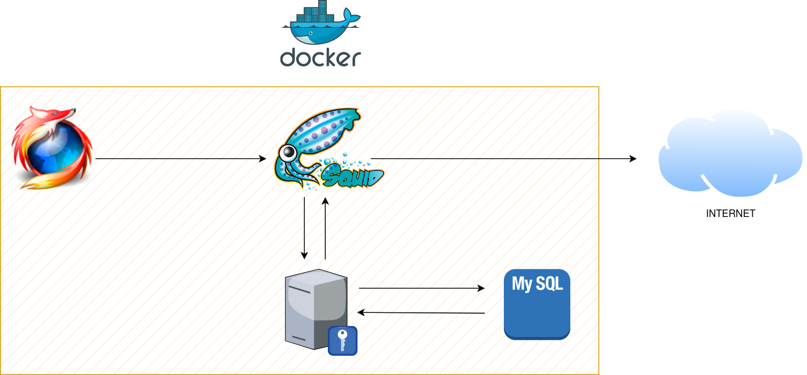

## Tasques a realitzar i detalls de la práctica




1. El *shared secret* és una clau compartida entre els clients i el servidor Radius. S'utilitza per a limitar l'ús no autoriztat del servidor d'autenticació. El secret compartit d'esta pràctica és *invent*.
2. Com a contrasenya de root de la BBDD MySQL podeu posar la que més vos agrade.
3. Heu d'omplir els ports a utilitzar per cada servici en el `docker-compose.yml`(son els ports per defecte del servicis).
4. L'arxiu *clients.conf* identifica quins dispositius poden comunicarse amb el servidor Radius amb intencions d'autenticar-se, **però no realitza l'autenticació. Eixa tasca pertany a l'arxiu users o, en el nostre cas, authorize**. 
   
    Has de crear un usuari en el arxiu **clients.conf** de Freeradius (el nomb és indiferent, nombés serveix per a identificar al client). **Mira el diagrama anterior atentament i tingues clar qui demanarà l'autorització a Radius**

5. A l'inici del fitxer **authorize** crear un usuari amb autenticació en text plà (la credencial serà el vostre nom i de contrasenya el cognom). Este arxiu <u>sí serveix per a l'autenticació</u>
6. Heu d'omplir l'arxiu **radius_config** de Squid.
7. Afegir una ACL (llista d'accés) que es cride `SSL_Ports` i que incloga el port 443.
8. Firefox enviarà tot el seu tràfic (http i https) al port configurat per a Squid. Configurar Firefox per a utilitzar el proxy, tant http, com https (mateix port d'Squid).
9.  Quan tot estiga funcionant, baixe-vos e instal·leu el certificat autogenerat per a que el tràfic HTTPS siga completament confiable i no done problemes.
10. Insertar un usuari en la BBDD `radius` **des del contenidor de *freeradius***, en la taula `radcheck`. Els valors:
    
        username --> Omplir
        attribute --> "Cleartext-Password"
        op --> ":="
        value --> Omplir

11. Totes les comprovacions s'han de fer mostrant els logs, tant d'Squid a on es puga veure tots els accesos a Internet que realitzeu, com de Freeradius i a on es mostren ambdòs autenticacions.

!!!warning "Atenció"
        Haurás de modificar el `radius.conf` del contenidor radius per a loguear els intents d'autenticació, tant si s'utilitza un password correcte, com si és incorrecte.
        Donat que no teniu editor de texts en el contenidor, podeu trobar utilitat en aquest comand:

        ```sh
        sed -i 's/Terme a sustituir/Terme nou/g' arxiu
        ```

## Contingut extra per a la recuperació de la pràctica

Per tal de completar la recuperació d'aquesta pràctica es demana, a més de tot lo anterior:

1. Configurar Squid per a que bloquegi totes les descarregues **majors de 10MB**. Podeu comprovar si funciona intentant baixar qualsevol distribució de Linux.
      + S'ha de mostrar comprovacions tant del navegador com dels logs.
  
2. Configurar Squid per a que bloquegi tot accés a Internet a la IP del client.
      + S'ha de mostrar comprovacions tant del navegador com dels logs.
  
        !!!note "Consell"
               Configurar el bloqueig abans de que arrive a saltar l'autenticació del proxy.


## Referències

[ Configuring a Squid Server to authenticate from RADIUS](https://wiki.squid-cache.org/ConfigExamples/Authenticate/Radius#create-radius-configuration-file)