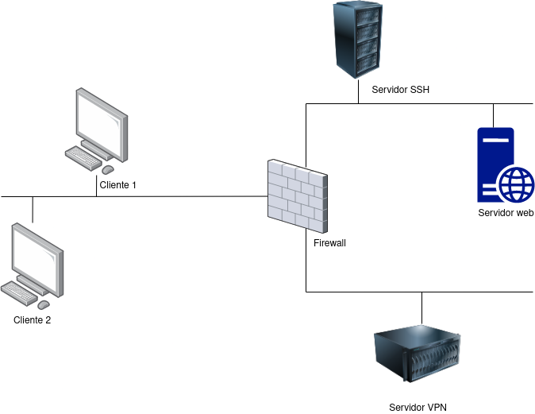
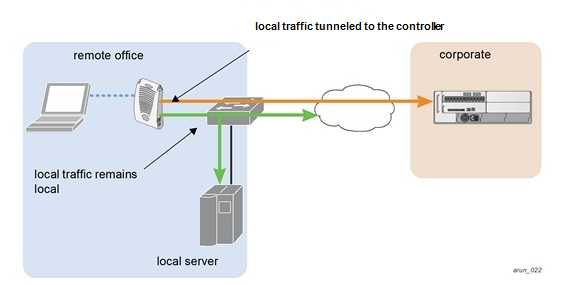

## Introducció

En aquesta pràctica configurarem un escenari simil·lar a una infraestructura empresarial real. Tenim un parell d'empleats que treballen a distància i necesiten fer ús d'una VPN. Hem evaluat les opcions i, encara que en principi havíem pensat utilitzar **OpenVPN**, finalment ens hem decidit per **Wireguard** amb la possibilitat de, si en un futur tenim més teletreballadors, canviar a OpenVPN.

Simularem la nostra infraestructura íntegrament amb contenidors Docker i serà tal que així:



Els clients establiran un túnel xifrat amb el servidor de VPN a la DMZ a través del firewall i aquest servidor, redirigirà el tràfic ja descifrat a la LAN. El tràfic de tornada seguirà el camí invers.

El túnel s'establirà mitjançant UDP i utilitzant el port **51820** entre cada client i el servidor de VPN.

## Tasques a realitzar    

1. Configurar la VPN per a que els dos clients puguen fer ús d'ella
2. Configurar el servidor VPN per a que assigne IPs del rang de la LAN
3. Comprovar que una vegada establerta la VPN, el tràfic viatja xifrat a través de la WAN i sense xifrar cap a la LAN.
4. Configurar el firewall (iptables) per a permetre les conexions al servidor web i al servidor SSH.

## Arxiu docker compose


```yaml linenums="1" hl_lines="142-146"
version: '3'

# Definim les xarxes que tindrem 
networks:
  wan:
    driver: bridge
    ipam:
      config:
        - subnet: ${WAN}
  lan:
    driver: bridge
    ipam:
      config:
        - subnet: ${LAN}
  dmz:
    driver: bridge
    ipam:
      config:
        - subnet: ${DMZ}

# Definim tots els endpoints que formaran part de l'escenari
services:
  client_1:
    build:
      context: ./dockerfiles
      dockerfile: Dockerfile
    container_name: client1
    hostname: client1
    extra_hosts:
      - "webserver: ${IP_WEBSERVER}"
      - "wireguard: ${IP_WIREGUARD}"
      - "sshserver: ${IP_SSHSERVER}"
    networks:
      wan:
        ipv4_address: ${IP_CLIENT_1}
    cap_add:
      - NET_ADMIN
    volumes:
      - ./wireguard:/etc/wireguard
    privileged: true
    command: /bin/bash -c "echo '1' > /proc/sys/net/ipv4/ip_forward && ip route del default && ip route add default via ${IP_FIREWALL_WAN} && exec sleep infinity"

  client_2:
    build:
      context: ./dockerfiles
      dockerfile: Dockerfile
    container_name: client2
    hostname: client2
    extra_hosts:
      - "webserver: ${IP_WEBSERVER}"
      - "wireguard: ${IP_WIREGUARD}"
      - "sshserver: ${IP_SSHSERVER}"
    networks:
      wan:
        ipv4_address: ${IP_CLIENT_2}
    cap_add:
      - NET_ADMIN
    privileged: true
    command: /bin/bash -c "echo '1' > /proc/sys/net/ipv4/ip_forward && ip route del default && ip route add default via ${IP_FIREWALL_WAN} && exec sleep infinity"

  firewall:
    build:
      context: ./dockerfiles
      dockerfile: Dockerfile.firewall
    container_name: firewall
    hostname: firewall
    working_dir: /usr/local/bin
    extra_hosts:
      - "client_1: ${IP_CLIENT_1}"
      - "client_2: ${IP_CLIENT_2}"
      - "webserver: ${IP_WEBSERVER}"
      - "sshserver: ${IP_SSHSERVER}"
      - "wireguard: ${IP_WIREGUARD}"   
    networks:
      wan:
        ipv4_address: ${IP_FIREWALL_WAN}
      lan:
        ipv4_address: ${IP_FIREWALL_LAN}
      dmz:
        ipv4_address: ${IP_FIREWALL_DMZ}
    privileged: true
    cap_add:
      - NET_ADMIN
    volumes:
      - ./iptables:/usr/local/bin
    command: /bin/bash -c "echo '1' > /proc/sys/net/ipv4/ip_forward && ip route del default && iptables-rules.sh && exec sleep infinity"

  webserver:
    build:
      context: ./dockerfiles
      dockerfile: Dockerfile.server
    container_name: webserver
    hostname: servidorweb
    extra_hosts:
      - "client_1: ${IP_CLIENT_1}"
      - "client_2: ${IP_CLIENT_2}"
      - "sshserver: ${IP_SSHSERVER}"
      - "wireguard: ${IP_WIREGUARD}"   
    networks:
      lan:
        ipv4_address: ${IP_WEBSERVER}
    cap_add:
      - NET_ADMIN
    command: /bin/bash -c "ip route del default && ip route add default via ${IP_FIREWALL_LAN} && service nginx start && exec sleep infinity"

  ssh_server:
    build:
      context: ./dockerfiles
      dockerfile: Dockerfile.ssh
    container_name: ssh_server
    hostname: ssh_server
    extra_hosts:
      - "client_1: ${IP_CLIENT_1}"
      - "wireguard: ${IP_WIREGUARD}"
    networks:
      lan:
        ipv4_address: ${IP_SSHSERVER}
    cap_add:
      - NET_ADMIN
    command: /bin/bash -c "ip route del default && ip route add default via ${IP_FIREWALL_LAN} && service ssh start && exec sleep infinity"
    restart: unless-stopped


  wireguard:
      image: lscr.io/linuxserver/wireguard:latest
      container_name: wireguard
      hostname: wireguard
      extra_hosts:
      - "client_1: ${IP_CLIENT_1}"
      - "server: ${IP_WEBSERVER}"
      networks:
        dmz:
          ipv4_address: ${IP_WIREGUARD}
      cap_add:
        - NET_ADMIN
        - SYS_MODULE
      command: /bin/bash -c "apk add tcpdump && ip route del default && ip route add default via ${IP_FIREWALL_DMZ} && exec sleep infinity"
      environment:
        - PUID=1000
        - PGID=1000
        - TZ=Europe/Madrid
        - SERVERURL=
        - SERVERPORT=
        - PEERS=
        - INTERNAL_SUBNET=
        - ALLOWEDIPS=
        - LOG_CONFS=false # No guardar conf en logs
      volumes:
        - ./volumes/wireguard:/config
        - /lib/modules:/lib/modules
      ports:
        - 51820:51820/udp
      sysctls:
        - net.ipv4.conf.all.src_valid_mark=1
        - net.ipv4.conf.all.forwarding=1
      restart: unless-stopped
```
    
La vostra tasca serà completar les variables d'entorn de les línies resaltades del docker-compose.

Quan s'inicie l'escenari correctamente, podreu trobar les configuracions de la VPN autogenerades a partir de les variables d'ambient d'aquest **docker-compose.yaml** en el contenidor de *wireguard*, en el directori `/config`. 

La configuració del client està dins del directori `/config/wg_configs` i la dels clients dins de `/config/peerX`, on la `X` és el número de client. Esta configuració haureu de copiar-la als respectius clients, dins del directori `/etc/wireguard` amb el nom de `wg0.conf`.

## Detalls de la VPN

La informació relativa a la configuració de la VPN és:

1. Els clients establiran el túnel xifrat amb la VPN del servidor
2. El port que faran servir és el 51820 UDP
3. Hi hauran dos clients
4. La subxarxa de la VPN serà la `192.168.10.0/24`
5. Les xarxes que s'han d'enrutar seran tant la LAN com la de la VPN

La VPN tindrá una subxarxa independent de les altres tres. No obstant, per a que siga funcional, farem que es puga comunicar amb la LAN.

A més, existeix un altre concepte que hem de conèixer, l'[split tunnelling](https://www.fortinet.com/lat/resources/cyberglossary/vpn-split-tunneling)

Mentre estigam connectats a la VPN potser que no ens interese que tot el tràfic siga encaminat per la VPN, per unes o altres raons. Un cas molt típic es quan a través de la VPN només es vol donar accés al treballador a recursos interns però no a Internet, per tal de reduïr el consum d'ample de banda de la xarxa de la empresa. És a dir, que l'empleat puga accedir a recursos compartits en la xarxa de la empresa amb la VPN però que navegue per Internet amb la seua pròpia línea d'internet.

Un altre cas típic:



Aleshores, en les línees del `docker-compose.yml` que heu d'emplenar, haureu d'indicar-le a la VPN que voleu encaminar pel túnel xifrat la pròpia subsarxa de la VPN i també la LAN, per a que puguen comunicar-se entre elles. 


